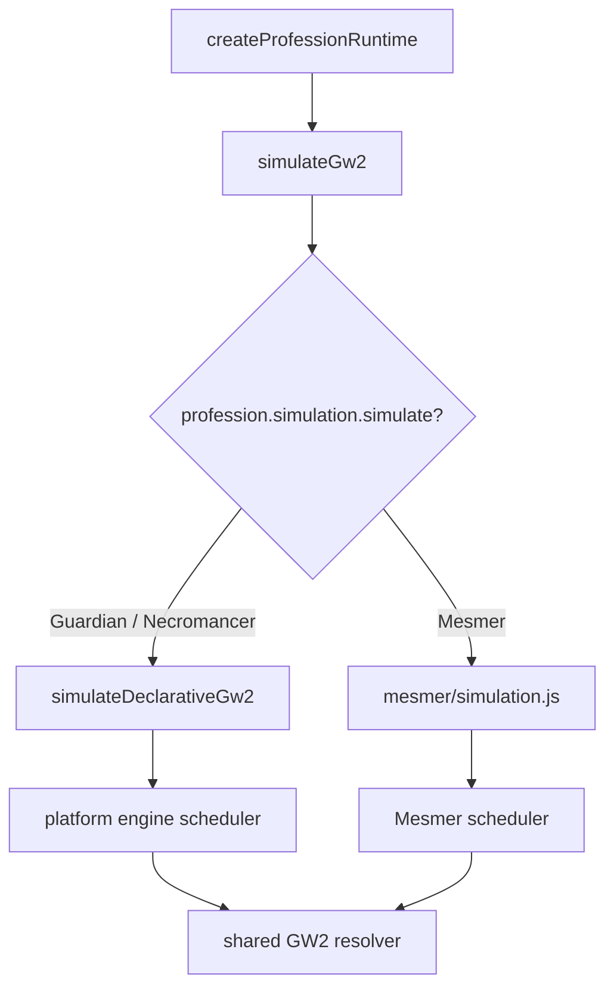
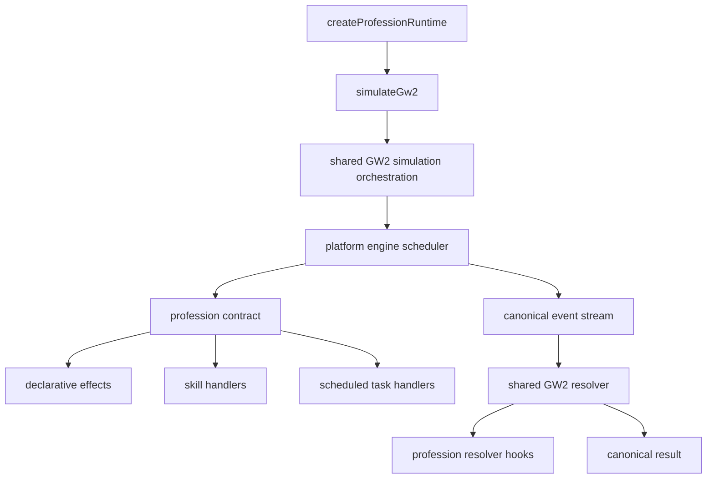

# Mesmer standard-simulator migration

Status: proposed implementation handoff  
Scope: Mesmer, the profession-neutral engine, and the shared GW2 simulation
pipeline  
Out of scope: Elementalist, balance changes, UI redesign, and build-schema
changes

This document supersedes the deferred Mesmer engine work in
`CONSOLIDATION_SPEC.md` (WI-5). It describes an iterative migration, not a
rewrite.

## Decision

Mesmer will stop supplying `profession.simulation.simulate`. Every supported
profession will enter the same `simulateGw2()` orchestration:

1. normalize the rotation;
2. schedule commands and profession mechanics on one deterministic clock;
3. build one canonical scheduled-event stream;
4. resolve that stream through the shared GW2 resolver;
5. build one canonical result shape.

The engine will not learn what a clone, phantasm, shatter, ambush, instrument,
or Continuum Split is. It will gain generic capabilities for:

- structured cast availability and standard cooldown waiting;
- chronological cast-start and cast-completion processing;
- typed, profession-owned scheduled tasks;
- observation of scheduled combat events;
- deterministic state snapshots and profession end-state projection.

Mesmer will implement its mechanics through those capabilities.

## Why the current hooks are not quite enough

The existing profession contract is close to the target. Guardian and
Necromancer already use `validateCast`, `scheduleSkill`, `afterCast`,
`advance`, resolver handlers, and resolver reactions.

Mesmer cannot safely move to that path yet because its production simulator
has behavior that the shared scheduler does not fully model:

- the branch's new shared cooldown wait handles ordinary serial recasts, but
  not profession readiness or readiness changed by an intermediate task;
- Continuum expiry can change the correct retry time while waiting;
- a concurrent cast is currently placed by shifting already-created events;
- state changes that logically occur at cast completion are applied while the
  rotation is being scheduled;
- clones and expected-value procs maintain their own recurring work queues;
- Mesmer catalog entries still expose the legacy `damage` and `conditions`
  schema while their canonical `effects` arrays are deliberately empty;
- Mesmer's runtime damage rules are still assembled by its private resolver
  query instead of profession attribute hooks.

Directly removing the override would therefore change timing, cooldowns,
resources, event ordering, damage, and UI state.

At handoff time, the working branch already contains the first narrow engine
improvement: a non-concurrent command advances to an ordinary skill or ammo
cooldown's exact expiry, with Guardian and Necromancer expectations updated.
Keep that change. PR 1 below generalizes it instead of replacing it.

## Current and target paths





## Ownership rules

### The engine owns

- the simulation clock;
- rotation normalization;
- serial and concurrent command cursors;
- cast lifecycle;
- waits and combat-start markers;
- cooldown and ammo bookkeeping;
- the scheduled-task queue;
- deterministic ordering;
- event-stream construction;
- canonical `steps`, warnings, cooldowns, ammo, and result envelopes.

### The shared GW2 layer owns

- Quickness and Alacrity policies;
- equipped-weapon validation;
- common event construction;
- attributes and combat formulas;
- sigils, relics, conditions, target state, and damage resolution;
- the public `simulateGw2()` entry point.

### A profession owns

- profession state and its public projection;
- cast availability beyond common cooldown/equipment rules;
- complex skill handlers;
- resource gains and costs;
- actor identity and lifecycle;
- recurring mechanic task handlers;
- profession event handlers and reactions;
- profession-specific attribute and damage modifiers.

The core rule is: **the engine owns when work runs; the profession owns what
that work means.**

## Target engine contracts

The names below are recommendations. Preserve the semantics even if names are
adjusted during implementation.

### 1. One public simulation entry

`simulateGw2()` must not dispatch to a profession-owned simulator.

```js
simulateGw2({
  profession,
  rotation,
  config,
  execution: {
    mode: "sequence",
  },
});
```

The standard sequence runner waits for a finite cooldown on a serial command.
A concurrent command never moves itself later to become available. The
transitional `config.autoWaitForCooldowns` field disappears once the legacy
Mesmer path is removed.

During migration, production Mesmer may retain its override. Candidate tests
must call `simulateDeclarativeGw2({ profession: mesmerProfession, ... })`
directly. Do not add production dual-running or a second Mesmer definition.

### 2. Structured cast availability

Boolean `validateCast` cannot distinguish a permanently invalid cast from a
temporarily unavailable one.

Add an ordered `castRules.availability` hook:

```js
// No return means ready.
function availability(context, skill) {
  return {
    ready: false,
    retryAt: 12.4, // null means it cannot become ready by waiting
    code: "mesmer.flip-not-armed",
    reason: "Counterspell is not armed.",
  };
}
```

Composition rules:

- any result with `ready: false` and `retryAt == null` blocks the cast;
- otherwise the latest finite `retryAt` controls;
- the engine's cooldown/ammo check participates as another availability rule;
- legacy `validateCast() === false` maps to a blocking result;
- warning text comes from the structured result rather than a generic
  `"unavailable"` message.

For a serial command with a finite `retryAt`, the scheduler advances to the
earlier of:

- the current `retryAt`; or
- the next scheduled task.

It then reevaluates availability. This matters because Continuum expiry can
restore cooldowns before the old ready time.

The loop needs a progress guard and a maximum action/task safety limit.

### 3. Chronological cast lifecycle

The scheduler should stop advancing directly to the end of every cast before
it knows whether the next command overlaps it.

Maintain separate cursors:

- `clock`: the latest processed timestamp;
- `serialReadyAt`: when the current serial cast lane is free;
- `previousCastStart`: the anchor for `concurrentOffsetMs`.

For each command:

1. calculate its requested start;
2. advance the clock and drain tasks only to that start;
3. evaluate availability;
4. reserve the cast;
5. emit its action and effects;
6. schedule a core cast-completion task at `effectiveEnd`;
7. update `serialReadyAt` without prematurely advancing `clock`.

Add temporal hooks rather than changing the meaning of `afterCast` in place:

```js
schedulerHooks: {
  onCastStart,
  onCastComplete,
}
```

`afterCast` can remain as a compatibility hook for Guardian and Necromancer
until they are migrated. New Mesmer code must use the temporal hooks.

The engine should track in-flight cast reservations so the same skill cannot
be accepted twice before its first cast completes. Cooldown/ammo mutations
that start at cast completion should be applied by the completion task. This
also lets a concurrent Continuum Split snapshot exclude a still-casting
skill without post-hoc repairs.

### 4. Typed scheduled tasks

Add an internal task queue to `platform/engine`. Tasks are state work, not
resolver events:

```js
context.tasks.schedule({
  type: "mesmer.clone-attack",
  at: 3.2,
  ownerId: "mesmer.clone:17",
  payload: { cloneId: 17 },
});

context.tasks.cancelOwner("mesmer.clone:17");
```

Profession definitions register namespaced handlers:

```js
schedulerHooks: {
  taskHandlers: {
    "mesmer.clone-attack": handleCloneAttack,
    "mesmer.resource-gain": handleResourceGain,
    "mesmer.expected-proc": handleExpectedProc,
    "mesmer.continuum-expire": handleContinuumExpire,
  },
}
```

Task requirements:

- sort by `at`, then priority, then insertion order;
- reject non-finite timestamps and unregistered required types;
- store serializable data, never callbacks;
- allow cancellation by task ID and owner ID;
- let a handler schedule its successor;
- drain all tasks at a timestamp before later commands;
- enforce a safety limit against zero-time recurrence;
- keep tasks out of the public event stream.

Use the existing event-queue ordering utilities where possible, but keep task
and resolver-event queues distinct.

This is intentionally smaller than a generic actor framework. Clones remain
Mesmer state. Necromancer minions remain Necromancer state. The common engine
only schedules typed work for an owner.

### 5. Scheduled-event observation

Some deterministic procs affect later cast legality. Bloodsong is the main
example: expected critical bleeding can generate a blade that a later shatter
spends. That state transition cannot wait until the resolver phase.

Add an ordered, read-only observation hook:

```js
schedulerHooks: {
  onEventScheduled(context, event) {
    // May update profession progress or schedule tasks.
    // May not mutate or replace the event.
  },
}
```

`context.emit()` should call it after producing the canonical event. Add a
recursion guard and document that newly emitted events are observed in their
own turn.

Scheduling-domain rules may project expected combat outcomes only when those
outcomes affect later scheduling. Final damage remains resolver-owned.

### 6. Profession state projection

Do not let a profession construct the complete result. Add a narrow hook if
the existing `snapshot` hook cannot express the required result:

```js
resources: {
  createProfessionState,
  createResolverState,
  projectEndState(context, resolvedProfessionState),
}
```

The shared simulation still owns:

```js
endState = {
  time,
  cooldowns,
  ammo,
  activeWeaponSet,
  profession: profession.projectEndState(...),
};
```

Mesmer's projection must provide the existing public fields:

- resource and resource definition;
- Clarity;
- Counterspell and flip availability;
- current ambush;
- autoattack-chain state;
- Continuum state and remaining duration.

No compatibility getters should remain on the root `endState`.

## Canonical Mesmer actor model

A clone should be profession state plus an owned scheduled task:

```js
{
  id: 17,
  ownerId: "mesmer.clone:17",
  weapon: "Sword",
  createdAt: 0.62,
  attackSequenceIndex: 0,
}
```

Lifecycle:

1. a resource-gain task creates the clone;
2. Mesmer schedules its first `mesmer.clone-attack` task;
3. the task handler emits canonical damage/condition events with
   `actorType: "summon"`, a clone `sourceId`, and the attacking `skillId`;
4. the handler advances the sequence and schedules the next attack;
5. replacement or shattering cancels all tasks owned by that clone;
6. no future clone events exist to be filtered by the resolver.

Phantasms are finite skill effects, not persistent clones. Their summon,
attack, Chronophantasma repeat, and conversion are scheduled by a phantasm
skill handler. Clone creation after conversion uses the same resource-gain
task as every other clone source.

This removes the `cloneDeaths` resolver handoff and
`shouldSkipMesmerResolverEvent` once all clone attacks are task-driven.

## Target Mesmer composition

```js
export const mesmerProfession = defineProfession({
  id: "mesmer",
  name: "Mesmer",
  catalog: mesmerCatalog,
  build: {
    createBuildDefaults: createMesmerBuildDefaults,
    migrateBuild: migrateMesmerBuild,
    validateBuild: validateMesmerBuild,
  },
  resources: {
    createProfessionState: createMesmerState,
    createResolverState: createMesmerResolverState,
    projectEndState: projectMesmerEndState,
  },
  attributeRules: mesmerAttributeRules,
  castRules: mesmerCastRules,
  schedulerHooks: mesmerSchedulerHooks,
  resolverHooks: mesmerResolverHooks,
  ui: mesmerUi,
});
```

There is no `simulation` member.

Suggested final layout:

```text
js/professions/mesmer/
  definition.js
  state.js
  attribute-rules.js
  catalog.js
  build.js
  ui.js
  mechanics/
    contract.js
    availability.js
    resources.js
    illusions.js
    phantasms.js
    continuum.js
    mirage.js
    instruments.js
    expected-procs.js
    handlers.js
    skill-defaults.js
    skill-overrides.js
    skill-mechanics.js
    autoattack-chains.js
  resolver/
    event-handlers.js
```

Profession-owned mechanics remain. Profession-owned orchestration does not.

## Current-to-target file mapping

| Current file | Target |
| --- | --- |
| `mesmer/simulation.js` | Delete after defaults, runner, result projection, and helper exports move to their owners |
| `scheduler/scheduler.js` | Delete; composition moves to `mechanics/contract.js` and the platform scheduler |
| `scheduler/cast-controller.js` | Split into `availability.js`, temporal hooks, and skill handlers |
| `scheduler/scheduler-state.js` | Delete; use `createMesmerState` through the platform scheduler |
| `scheduler/cooldown-controller.js` | Delete; Shatter Storm becomes `modifyMaximumAmmo` |
| `scheduler/event-factory.js` | Delete; emit canonical events through `context.emit` |
| `scheduler/resource-controller.js` | Move to `mechanics/resources.js` and typed resource tasks |
| `scheduler/expected-procs.js` | Move to `mechanics/expected-procs.js` using scheduled-event observation |
| `scheduler/skill-effects.js` | Split between canonical effects, phantasm handlers, and focused exception handlers |
| `mechanics/illusion-actions.js` | Keep behavior in `mechanics/illusions.js`, driven by tasks |
| `mechanics/continuum-controller.js` | Keep behavior in `mechanics/continuum.js`, invoked through handlers/tasks |
| `resolver/resolve-timeline.js` | Delete when the shared resolver is the only path |
| `resolver/resolver-profile.js` | Delete after reactions come only from the profession contract |
| `resolver/resolver-query.js` | Delete after its rules move to shared queries plus attribute hooks |
| `resolver/combat-stats.js` | Convert to stable-ID `attribute-rules.js` hooks |
| `resolver/damage-modifiers.js` | Convert to stable-ID attribute/damage hooks |
| resolver hit/condition/runtime wrappers | Delete when no Mesmer-only constructor options remain |

`createDefaultConfig()` belongs in test fixtures or shared application config.
`skillById()` and `availableSkills()` are catalog queries. `calculatedAttributes()`
belongs to the attribute calculator. They are not simulation responsibilities.

`simulateRotation()` currently has no repository caller other than the Mesmer
override. Deprecate and remove it unless a real benchmark caller is identified.
If looped execution is required, implement it as a shared engine runner rather
than another profession simulator.

## Migration strategy

The production Mesmer path stays unchanged until the final cutover. All new
Mesmer contract hooks can be added safely because the legacy override ignores
them. Candidate tests invoke `simulateDeclarativeGw2()` directly with the same
`mesmerProfession`.

Each mechanic PR should also port the attribute/resolver rules needed by that
feature. PR 8 is the convergence and deletion pass, not the first time the
candidate receives Mesmer damage rules.

### PR 0 — Differential oracle

Add:

- `tests/helpers/mesmer-simulation-oracle.js`;
- a result normalizer and comparator;
- a compact fixture matrix covering the behaviors below.

Compare legacy `simulateSequence()` with the standard candidate. Compare:

- exact command steps, validity, invalid reasons, warning strings, event
  types/order/timestamps, cooldowns, ammo, weapon set, and profession state;
- damage values within an explicit floating-point tolerance;
- maps/sets after canonical serialization.

Do not snapshot the entire 160-test suite into opaque JSON. Use named fixtures
and readable mismatch output.

Initial fixture matrix:

1. simple strike and condition skill;
2. serial cooldown wait and concurrent cooldown rejection;
3. wait, combat-start, interruption, and concurrent instant;
4. weapon swap and autoattack chains;
5. flip arming, expiry, and ammo mantra;
6. clone creation, replacement, attacks, and shatter;
7. phantasm attack, Chronophantasma repeat, and clone conversion;
8. Virtuoso blade generation and Bloodsong;
9. Mirage Cloak, player ambush, and Infinite Horizon clone ambush;
10. Troubadour instruments and notes;
11. Continuum manual shift, expiry, cooldown restore, and ammo restore;
12. sigils, relics, target death, and public end state.

Exit gate: the harness can show known mismatches without changing production.

### PR 1 — Scheduler temporal foundation

Implement and test, using fixture professions only:

- structured availability;
- extend the branch's basic serial cooldown wait to profession readiness and
  intermediate task reevaluation;
- task queue and namespaced task handlers;
- chronological command cursors;
- cast-start and cast-completion hooks;
- in-flight cast reservations;
- scheduled-event observation.

Guardian and Necromancer production results must remain unchanged.

Exit gate:

- a task occurring during a cast runs before a concurrent command at a later
  timestamp;
- a task can change cast readiness while the engine waits;
- an interrupted cast completes at the interrupted timestamp;
- same-time ordering is deterministic;
- zero-time task loops fail clearly.

### PR 2 — Mesmer standard contract shell

Add `mechanics/contract.js` and wire it into `definition.js` while retaining
the production simulation override.

Move:

- initial state and specialization resource selection;
- stable-ID availability checks;
- cast/recharge/ammo modifiers;
- public end-state projection;
- existing resolver event handlers and reactions.

Port one deliberately simple skill end to end through canonical `effects`.

Exit gate: the candidate matches the oracle for the simple-skill,
combat-start, wait, cooldown, and result-shape fixtures.

### PR 3 — Ordinary skills and shared cast state

Convert the legacy skill `damage`/`conditions` schema into canonical effects
for ordinary skills. Do this in `skill-defaults.js`/`skill-overrides.js`, not
inside the scheduler.

Port:

- standard strikes, conditions, pulses, and channels;
- weapon swap;
- autoattack chains;
- flips and ammo mantras;
- interrupts;
- skill-specific cooldown resets;
- Clarity and other simple timed buffs.

Complex phantasm, shatter, ambush, instrument, and Continuum skills should use
stable `handlerId` values and remain for later PRs.

Exit gate: ordinary-skill fixtures and their existing focused tests pass on
the candidate.

### PR 4 — Resources and clones

Port resource gains to typed tasks, then port clone lifecycle:

- clone/blade/note caps;
- clone replacement;
- clone attack sequences;
- clone conditions;
- shatter consumption and cancellation;
- Compounding Power and resource-gain traits.

Use source IDs and actor types, not display names, for behavior.

Exit gate: clone fixtures match without `cloneDeaths` filtering in the
candidate path.

### PR 5 — Phantasms and expected procs

Port:

- phantasm summon/attack/conversion timing;
- Chronophantasma;
- Phantasmal Haste, Fury, Blades, and Lancer/Clarity behavior;
- expected critical progress that can generate scheduler resources;
- related resolver-only critical reactions.

Keep scheduling-relevant expected progress in the scheduler and final damage
in the resolver.

Exit gate: phantasm and Virtuoso fixtures match, including a later skill that
spends a blade generated by an earlier expected proc.

### PR 6 — Specialization and palette mechanics

Port:

- Mirage Cloak and ambush windows;
- Infinite Horizon clone ambushes;
- Troubadour instruments and Crescendo;
- remaining shatter variants;
- remaining flip, chain, and specialization availability.

Exit gate: all non-Continuum candidate fixtures and focused tests pass.

### PR 7 — Continuum Split

Port Continuum last because it exercises almost every scheduler boundary.

Keep the checkpoint profession-owned, but use engine state/services:

- snapshot eligible cooldowns and ammo;
- snapshot Mesmer autoattack-chain state;
- exclude in-flight casts that have not completed;
- schedule typed expiry work;
- restore on manual shift or expiry;
- preserve unaffected cooldowns such as weapon swap;
- re-run availability after restoration.

Do not shift already-emitted events or repair snapshots after the fact.

Exit gate: every existing Continuum and concurrent-cast test passes on the
candidate with exact timing/state parity.

### PR 8 — Resolver convergence

Move remaining name-based query rules to stable trait/skill IDs and the
profession attribute hooks:

- dynamic attributes;
- critical chance and critical damage;
- strike/condition multipliers;
- condition duration;
- Egotism and health-threshold behavior;
- instrument and timed-buff modifiers.

Delete candidate-path use of Mesmer resolver constructors one wrapper at a
time.

Exit gate: complete differential fixture parity and all Mesmer damage tests
pass through the standard candidate.

### PR 9 — Production cutover and deletion

1. make `simulateGw2()` always run the shared orchestration;
2. remove `mesmerProfession.simulation.simulate`;
3. update tests to call `simulateGw2()` rather than `simulateSequence()`;
4. remove the direct Mesmer simulation imports from fixtures;
5. delete `mesmer/simulation.js` and obsolete scheduler/resolver wrappers;
6. remove the `cloneDeaths` compatibility handoff;
7. update `ARCHITECTURE.md`, `MODULES.md`, and
   `CONSOLIDATION_SPEC.md`.

After the cutover, delete the unused `platform/engine/simulation.js` unless a
real non-GW2 consumer is introduced. Rename
`platform/gw2/declarative-simulation.js` only as a final cleanup; do not mix
that naming churn into the mechanical migration.

Exit gate:

```powershell
npm test
npm run check
rg "professions/mesmer/simulation|simulateSequence" js tests
rg "simulation:\\s*Object" js/professions/mesmer
```

The searches must return no production Mesmer simulation path.

## Pull-request discipline

- Keep platform capability PRs separate from Mesmer mechanic PRs.
- Prove every platform capability with a fixture profession before Mesmer
  consumes it.
- Keep the legacy implementation untouched as the oracle until cutover.
- Migrate behavior by feature, not by copying entire old files into new
  handlers.
- Record intentional parity changes separately from migration changes.
- Require stable IDs in all new behavior. Names are display and migration
  inputs only.
- Do not add `profession.id === "mesmer"` branches under `platform/`.
- Do not put callbacks or class instances in scheduler state or tasks.
- Do not let resolver code mutate scheduler state.
- Do not make the public app run both simulators.

## Definition of done

- Guardian, Mesmer, and Necromancer use one `simulateGw2()` orchestration.
- No supported profession supplies `simulation.simulate`.
- Mesmer uses the platform scheduler for commands, timing, cooldowns, ammo,
  waits, concurrency, interrupts, tasks, and stream construction.
- Mesmer-specific mechanics exist only as state, rules, handlers, and
  reactions.
- The resolver receives only the canonical scheduled-event stream and a
  serializable handoff.
- `endState` has one canonical shape with profession data under
  `endState.profession`.
- Existing behavior is covered by differential fixtures and focused tests.
- `npm test` and `npm run check` pass.
