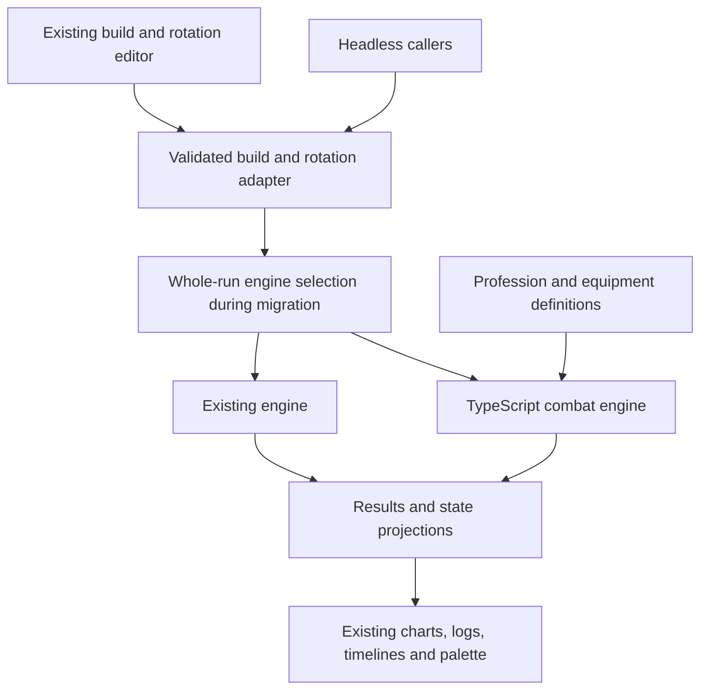

# gw2combat TypeScript migration: Guardian first, all professions

Date: 2026-09-16  
Status: implementation plan; no replacement engine has been implemented by this document.  
Target: all nine professions and their supported core/elite specializations, using the existing browser application.

## 1. Objective and completion boundary

Replace the current GW2 scheduler/resolver implementation with a TypeScript combat engine based on
[Mk-Chan/gw2combat](https://github.com/Mk-Chan/gw2combat). Preserve the existing build editor, rotation workflow,
presentation, saved data, and analysis features through explicit application adapters.

Guardian is the first implementation and validation vehicle. It is not the architecture's scope, and completing
Guardian does not complete this migration. The final engine must support Elementalist, Engineer, Guardian, Mesmer,
Necromancer, Ranger, Revenant, Thief, and Warrior without a separate simulation loop for each profession.

The intended benefit is one authoritative combat state: cast decisions, resource changes, damage, effects, and trait
reactions participate in the same simulation lifecycle. A port alone does not prove greater accuracy, better
performance, or simpler profession authoring; the milestones below must establish those outcomes.

The first deliverable is one upstream Guardian build running in TypeScript, checked against a pinned C++ reference,
and usable through the current UI, including rotation insertion and state-dependent skill availability. The final
deliverable also requires migration of every profession, application feature acceptance, and retirement of the old
runtime and temporary routing.

## 2. Evidence and current constraints

This plan is based on source inspection, not an executed C++/TypeScript comparison. The upstream commit, reproducible
C++ build, measured performance baseline, and complete mechanic inventory remain Phase 0 work.

### Current application

- [Architecture](ARCHITECTURE.md) and [module ownership](MODULES.md) already separate the kernel, GW2 platform,
  professions, application, and presentation.
- [simulateGw2](../../js/games/gw2/platform/simulation/simulate.ts) is the canonical simulation entry point.
- [The current pipeline](../../js/games/gw2/platform/simulation/pipeline.ts) schedules a rotation and then resolves
  its events. Optional refinement passes feed resolved information back into scheduling.
- [The clock contract](SIMULATION-EVENT-CLOCK.md) uses event-driven progression and microsecond canonical precision.
- [The baseline worker](../../js/games/gw2/app/simulation/baseline/baseline-simulation-worker.ts) already isolates expensive
  computation from the browser editor. Other simulation callers include the optimizer, RNG distribution, modifier
  contributions, relic comparison, patch comparison, and rotation prefix previews.
- [Palette state](../../js/games/gw2/app/rotation/context.ts) depends on simulation state at the insertion
  cursor, not only on final DPS. Existing result types also expose scheduler internals that will need adaptation.
- [Guardian's implementation notes](../professions/GUARDIAN.md) describe Core, Dragonhunter, Firebrand, Willbender,
  and Luminary. Those all belong in the Guardian migration scope.
- The project already compiles strict TypeScript. Retain the existing TypeScript, Vite, Node test, and Playwright
  toolchain; a frontend rewrite is unnecessary.

### Upstream reference

- [The README](https://github.com/Mk-Chan/gw2combat/blob/master/README.md) describes build/rotation configuration and
  an entity-component-system architecture.
- [The combat loop](https://github.com/Mk-Chan/gw2combat/blob/master/src/combat_loop.cpp) advances an integer tick and
  runs ordered systems. Its millisecond progression differs from this application's event-driven clock.
- [Skill configuration](https://github.com/Mk-Chan/gw2combat/blob/master/src/configuration/skill.hpp) contains skill
  ticks, effects, modifiers, triggers, conditions, and bundle transitions.
- [Resources](https://github.com/Mk-Chan/gw2combat/tree/master/resources) include Guardian and Soulbeast examples;
  upstream is not strictly Guardian-only. These examples do not establish complete profession coverage.
- [The license](https://github.com/Mk-Chan/gw2combat/blob/master/LICENSE.txt) is MIT. Preserve the copyright and license
  notices with translated or copied material and account for any separately vendored dependencies.

These upstream links follow `master` for discovery. Phase 0 must record the selected full commit SHA and replace
reference-run dependencies with that immutable revision.

## 3. Scope and architectural decisions

| Area | Decision |
| --- | --- |
| Language | TypeScript, using the repository's strict compiler settings |
| Runtime | Headless Node execution and browser workers from the same engine source |
| Combat state | One authoritative world per run, with actor ownership and ordered combat systems |
| Initial clock | Faithfully reproduce the pinned upstream tick and ordering semantics before optimizing |
| Content | Profession-owned definitions and mechanics; shared combat rules remain profession-neutral |
| UI | Retain the application and adapt inputs/results/state projections |
| Migration | Add the new engine alongside the old one; select one engine for each entire run |
| Validation | Separate upstream fidelity, current-game evidence, and application compatibility |
| Final scope | Every currently supported profession and specialization, with explicit modeling limitations |

Do not translate C++ templates or its ECS library into a general TypeScript framework. Begin with typed records,
arrays, maps, entity IDs, and directly ordered system functions. Reuse existing helpers only after establishing that
their semantics match the target contract. Do not import the old scheduler/resolver as a hidden implementation of
new-engine mechanics.

The core must not branch on profession names. Shared concepts include actors, skills, effects, resources, cooldowns,
ownership, and termination. Profession-specific resources and state machines live with their profession; their
actual requirements determine which shared operations are necessary. Do not prebuild every possible resource model
before a real mechanic needs it.

Preserve today's documented product scope, including outgoing-damage and encounter assumptions. Supporting all
professions does not implicitly add complete raid AI, positioning, PvP/WvW, or a full healing/support simulator.
Support-only actions that affect timing or traits must retain their modeled behavior. Record limitations explicitly.

## 4. Target composition and ownership



The routing layer and legacy branch are temporary. The final application has one engine.

### Suggested placement

Choose final names in Phase 0 after checking import-boundary rules. The following is an ownership proposal, not a
request to scaffold empty modules:

| Responsibility | Suggested location or existing boundary |
| --- | --- |
| New combat runtime | `js/games/gw2/platform/combat-engine/` |
| Shared world, clock, systems, effects, formulas | Inside the new runtime, split only as working code requires |
| Guardian implementation during coexistence | `js/games/gw2/professions/guardian/combat-engine/` |
| Other profession implementations | The equivalent directory under each profession |
| Reusable identity and presentation metadata | Existing profession catalogs/data, extracted from runtime assembly if necessary |
| Engine selection and request/result conversion | Existing platform simulation and GW2 application boundaries |
| Reference comparison tooling | `scripts/analysis/` |
| Focused contracts | Existing `tests/platform/`, `tests/professions/`, `tests/gw2/app/`, and `tests/app/` ownership |

New runtime code must not import browser application modules. Profession implementations may import shared combat
operations; shared combat code must not import profession implementations. Keep identity metadata independent of
both runtimes so loading a new profession does not incidentally assemble its legacy runtime.

Existing skills, trait selections, equipment, icons, IDs, and saved formats are reusable assets. Existing
scheduler/resolver callbacks are reference behavior to investigate and rewrite, not directly reusable new-runtime
mechanics. Avoid maintaining two hand-authored copies of the same immutable facts during migration.

## 5. Simulation lifecycle to implement

This lifecycle applies to every profession. Guardian exercises it first.

### 5.1 Validate and prepare a request

1. Validate imported builds, rotations, encounter values, IDs, numeric ranges, and supported capabilities at runtime.
2. Resolve the selected Core plus elite specialization, loadout, equipment, traits, patch data, and assumptions.
3. Convert saved/UI commands into typed engine commands while retaining their source indices for diagnostics.
4. Resolve engine selection once for the entire request. Record engine revision, data revision, mode, and seed in
   diagnostic metadata so a run can be reproduced.
5. Prepare immutable content independently of mutable run state. An optimizer may reuse immutable definitions;
   it must never share live actors, cooldowns, resources, or RNG state between trials.

TypeScript types are not a substitute for validation of JSON. Unknown or unsupported mechanics must be reported with
the responsible skill, trait, equipment item, or command. Never silently drop them to produce a plausible score.

### 5.2 Initialize a world

Create the player, target, owner relationships, selected skills, effects, resources, and random generator. Initialize
the logical clock and deterministic iteration order explicitly. Define how precasts and the combat-start marker map
to engine time without resetting cooldowns, resource changes, or effects that should carry into combat.

Keep the absolute simulation clock, combat-start reference, and DPS observation window distinct. The existing UI's
milliseconds/seconds conversions belong at named boundaries rather than being scattered through mechanics.

### 5.3 Advance combat

For the initial port, translate the pinned upstream's exact phase ordering, repeat-until-stable behavior, temporary
markers, and cleanup semantics. Extract a reviewed order table from that revision rather than inventing a simplified
equivalent. Preserve distinctions among accepting a cast, completing it, performing its packets, and resolving hits.

The contracts to settle include:

- Cast lanes, instant actions, channels, interrupted actions, and availability retries.
- Resource validation, spending, refunds, regeneration, cooldown commitment, ammo recharge, and resets.
- Skill pulses, delayed hits, projectiles, chained/triggered skills, and proc recursion limits.
- Attribute sampling, modifier ordering, critical/weapon rolls, and rounding.
- Boon/condition application, stack ownership, refresh, extension, consumption, expiration, and damage pulses.
- Actor spawn/despawn, independent actions, inherited attributes, and damage attribution.
- Equal-time ordering among all of the above and target death.

Use deterministic logical time, never wall-clock timers for combat. Add bounded-work protection and actionable failure
diagnostics for non-terminating rotations or trigger cycles. Do not swallow a simulation failure and expose a partial
result as a successful score.

### 5.4 Observe, terminate, and report

Define rotation exhaustion, active-skill completion, explicit duration, damage thresholds, target death, and optional
observation tails separately. Document whether boundary events are included and how precedence works when several
termination conditions occur together.

Accumulate the same damage in detailed and score-only modes. Score mode may omit histories and projections; it must
not change combat execution, proc decisions, or random draws. Diagnostics must also avoid changing those draws.

Return a structured result or explicit failure. Detailed output supplies activation identities, damage attribution,
timelines, warnings, resources, cooldowns, ammo, and the snapshots needed by the application. Clean up run-local state
so subsequent worker requests cannot inherit it.

### 5.5 Project editor state

The palette must answer availability at the rotation insertion point, including an insertion before the final
command and appending when the displayed simulation includes an observation tail. Define this instant precisely;
it is not necessarily the final damage timestamp.

Start by replaying the required prefix with the new engine and projecting its state. Include delayed actions already
active at that instant. Optimize with checkpoints only if profiling shows prefix replay is too expensive. A cached
projection must be invalidated by build, rotation, patch, engine, mode, and relevant seed changes.

The engine owns legality. The UI consumes its projected state or availability queries rather than maintaining a
second implementation of resource, cooldown, or profession rules.

## 6. Timing and fidelity policy

Port fidelity and current-game correctness are separate milestones. The initial reference lane uses the pinned C++
definitions and semantics. The production lane uses the selected game-data patch and explicitly reviewed deviations.
These can be separate development fixtures and data revisions; they do not require a permanent user-facing
compatibility mode or two independently maintained engines.

Before accepting real saved rotations, record the conversion policy for fractional milliseconds. Do not silently
round microsecond timestamps into integer ticks. If the production engine needs finer precision, change it in a
separate, evidenced step after reference fidelity, with focused boundary checks.

Likewise, audit same-time strike/condition order, effect lifetime boundaries, condition tick offset, periodic damage,
rounding, prepull behavior, and termination. The old engine, upstream engine, and game evidence can disagree. Record
each discrepancy and choose the intended behavior explicitly; matching either engine alone does not settle it.

Preserve observed cast behavior during translation, but follow the repository rule against adding tests specifically
for Quickness cast times or `interruptCommitMs` values.

Expected-value damage and stochastic execution also need separate definitions. A mean critical-damage multiplier
does not automatically model a critical-hit proc that changes later resources or casts. Inventory such branching
mechanics, document approximations, and use seeded stochastic behavior where required. C++ and TypeScript need not
share random samples unless the same RNG and draw order are deliberately ported; deterministic reference comparisons
must not accidentally depend on unrelated random sequences.

## 7. Delivery phases and exit gates

Each phase leaves runnable work and updates this document's status ledger. A phase is complete only when its exit
evidence is recorded. Several Guardian milestones do not imply all-profession readiness.

### Phase 0 — Inventory and reproducible reference

Deliverables:

- Pin the upstream SHA, source/license provenance, build toolchain, dependencies, build command, and run command.
  Keep C++ as a development reference; do not add a server dependency to the browser product.
- Build and run a reference encounter on a documented supported environment. If Windows needs WSL or a container,
  document the actual working route and its prerequisites.
- Select one Guardian fixture. Start by evaluating upstream's Willbender pistol/torch example because it is linked
  from its encounter configuration; confirm the selected revision's exact paths and that the encounter runs.
- Inventory every mechanic reached by that build, including shared traits, equipment effects, triggered skills,
  and target assumptions. Select a smaller included fixture if this dependency closure is unsuitable for a first pass.
- Capture the exact source/input/data revisions and reproducible aggregate results. Establish small reference
  scenarios for the shared contracts needed by the selected build.
- Inventory all production engine callers, result consumers, saved-data versions, Guardian mechanics, and all-profession
  coverage. Trace code rather than relying solely on implementation notes.
- Measure current latency, batch throughput, prefix replay, worker startup, memory, and bundle size on named workloads.
- Work in an isolated branch/check-out and preserve unrelated in-progress changes already in the repository.

Exit: another developer can reproduce the C++ run; the first Guardian scope and required contracts are enumerated;
the upstream revision and initial workload measurements are recorded. Do not claim reference parity before this gate.

### Phase 1 — Shared TypeScript kernel and minimal combat

Implement world initialization, stable entity ownership, ordered system execution, commands, casts, cooldowns, basic
effects, strike/condition damage, observation boundaries, and termination as required by the first fixture.

Define typed input, output, and diagnostic contracts. Use the current build/test infrastructure and add only the
focused engine checks needed to establish each behavior. Prove headless execution without browser globals.

Exit: minimal synthetic encounters run reproducibly in Node and a worker; tests cover their scheduling, state,
resource, ordering, and termination contracts. No Guardian-specific branch exists in the shared core.

### Phase 2 — First Guardian build and reference fidelity

Port the selected build's entire dependency closure: weapon and slot skills, its virtue behavior, selected traits,
equipment procs, attributes, condition effects, and required target configuration. Use the frozen upstream inputs
first; do not combine translation with current-patch coefficient edits.

Run C++ and TypeScript on focused matching scenarios. Investigate discrepancies at the earliest differing state
transition or calculation. Resolve integer division, rounding, iteration order, default-value, enum, and lifetime
differences explicitly instead of tuning damage coefficients until totals happen to match.

Run the full reference encounter as a diagnostic comparison. Automated saved-preset regressions remain limited to
loading/simulation and total DPS against a documented manifest value with at most 1% relative error.

Exit: the first build is executable, required mechanics have focused coverage, unexplained differences in those
contracts are resolved, and aggregate reference results satisfy the declared acceptance criterion. Full Guardian
coverage and current-game validation remain incomplete.

### Phase 3 — Existing UI integration for that build

Add temporary whole-run selection at the common simulation boundary, then trace every caller to ensure it uses it.
Adapt existing saved build/rotation inputs, result views, warnings, and prefix-state queries.

The first usable slice includes build selection, rotation editing, skill availability, cooldown/ammo/resource display,
timeline, damage breakdown, event log, and target/observation settings for the supported build. Unsupported analysis
features are explicitly unavailable for the preview until migrated; they must not quietly invoke a different engine.

Retain worker request identity and stale-result rejection. Test cancellation or worker replacement for expensive runs;
do not assume a synchronous tick loop can respond to a queued cancellation message while blocking the worker.

Exit: a supported Guardian build can be loaded, edited, simulated, and inspected in the existing UI; insertion-state
previews agree with execution; unsupported combinations are clearly rejected or use explicitly selected legacy mode.

### Phase 4 — Current-patch Guardian content and full Guardian scope

Expand from the reference fixture to the complete Guardian inventory below. Migrate current authoritative content
and document deviations from the frozen upstream reference. Validate mechanics with controlled game evidence when
available, and record uncertainty where it is not.

Complete all Guardian-facing analysis paths: deterministic and seeded RNG runs, optimizer score mode, modifier and
relic comparisons, patch previews, reference rotations, EVTC imports, and exports. Every analysis must use the same
selected engine semantics and appropriately validated content.

Exit: Core and every supported Guardian elite meet their coverage checklists, saved presets load and simulate with
visible/accounted-for warnings, and all existing Guardian product features work or retain an explicitly documented
pre-existing limitation. One successful benchmark is not this gate.

### Phase 5 — Prove portability with other professions

Before declaring the authoring contract stable, implement a focused Thief slice for resource-gated casting and a
Ranger slice with an independently acting pet. Soulbeast reference examples alone do not prove autonomous pet support.

These slices use the same world and loop as Guardian. Extract shared operations only where the concrete mechanics
show the need. Feed contract changes back through Guardian's focused tests and UI acceptance checks.

Exit: at least one resource-driven non-Guardian build and one build with an independently acting owned actor work
through the shared runtime. There is no Guardian-specific assumption in skill selection, resources, ownership,
output attribution, or state projection. Remaining specs for those professions are still tracked as unported.

### Phase 6 — Performance acceptance and Guardian default cutover

Use the same hardware/browser/Node versions and named workloads as Phase 0. Compare cold/warm single runs, prefix
editing, detailed/score runs, RNG batches, optimizer workloads, allocations, and retained worker memory.

Record numeric acceptance budgets before deciding readiness. The initial proposal is no more than 20% regression in
warm interactive p95 latency or batch elapsed time versus the recorded baseline, no unbounded retained-memory growth,
and responsive editing during background work. These are proposed gates, not measured results; tighten them if the
old experience is already too slow. Any changed budget must be recorded with its user impact.

Optimize only measured bottlenecks. Consider immutable-content reuse, output allocation reduction, then proven clock
or storage optimizations. Skipping ticks requires proving that no periodic work, boundary, or condition sample is
lost; performance does not justify silently changing simulation semantics.

Make the new engine Guardian's default only after Phases 4–6 pass. Retain temporary legacy selection for rollback,
with engine identity clear in comparisons and diagnostics. Do not overwrite user builds to change the default.

Exit: recorded acceptance results support the cutover, unsupported combinations cannot masquerade as supported,
and a documented rollback has been exercised.

### Phase 7 — Complete all professions

Migrate each remaining profession using the same lifecycle: inventory, focused mechanics, application integration,
game-evidence review, preset checks, performance, default cutover, and rollback readiness.

The sequence below is provisional and ordered by useful contract pressure. It is not a restriction on eventual scope.
Finish each profession's supported core/elite coverage rather than treating a successful sample build as completion.

Exit: every row in the all-profession matrix is accepted, and shared changes have been checked against previously
migrated professions. Future or newly added specializations use this same lifecycle.

### Phase 8 — Retire legacy code and temporary compatibility

Remove old engine routing, scheduler/resolver-specific profession registrations, duplicate content, obsolete result
fields, and transition-only adapters after all professions and consumers have migrated. Preserve useful engine tests
by moving their contracts rather than deleting coverage wholesale.

Retain saved-build and rotation compatibility where users still need it. Retiring an execution engine is not a reason
to discard user-data migrations. Archive the frozen reference instructions and provenance. Update architecture,
programmatic API, profession, and contributor documentation to describe the final engine.

Exit: production has one engine; no runtime caller depends on the old scheduler/resolver; the full repository checks
pass; all nine professions and existing product workflows remain usable. This is the migration's completion gate.

## 8. Guardian coverage and implementation order

The exact first-build dependency closure takes priority over the order below. For example, the initial Willbender
fixture necessarily brings its required Willbender mechanics forward. No specialization may be marked complete from
that partial implementation.

| Slice | Inventory and behavior to account for | Acceptance evidence |
| --- | --- | --- |
| Shared foundations | Attributes, gear, runes/sigils/relics, boons, conditions, target assumptions, trait selection, weapon eligibility | Focused formulas, stacking, proc, loadout, and validation contracts |
| Core | All supported terrestrial weapons and slot skills; chains, flips, symbols, channels, delayed/persistent attacks; Justice/Resolve/Courage; Renewed Focus; weapon swaps | Skill-family coverage, virtue state transitions, cooldown/resource/ordering checks, palette behavior |
| Weapon-specific state | Pistol/torch interactions, spear illumination, persistent fields, finishers, variant identities, and other inventory findings | Minimal state/lifetime scenarios and correct available-skill projections |
| Dragonhunter | Modified virtues, Spear of Justice/Hunter's Verdict, traps, traits, and supported weapon interactions | Link/flip/lifetime contracts and build/UI acceptance |
| Willbender | Movement virtues, virtue windows, hit-triggered behavior, trait stacks, off-target assumptions, and weapon interactions | Trigger ownership, shared-time ordering, refresh/expiration, and modifier contracts |
| Firebrand | Tome entry/stow, shared pages, costs/regeneration, chapter availability, trait changes, Ashes attribution/consumption | Resource and bundle transitions, regeneration and effect ownership, palette/state acceptance |
| Luminary | Radiant Forge entry/exit/duration, radiant weapons, Glaring Burst variants, recharge changes, light-field/finisher interactions | Form and lifetime transitions, variant identities, cooldown changes, combo contracts |
| Whole profession | Core plus each elite, every supported build option, import/export, prefixes, reference runs, optimizers, RNG and patch previews | Feature acceptance and saved-preset load/simulation/DPS checks |

The inventory must include passive traits, trait substitutions, inherited core mechanics, equipment interactions, and
user-selectable assumptions, not only skills present in saved benchmark rotations. Audit the current source before
treating these rows as exhaustive.

For each mechanic, record: source and patch; owner; inputs; state written/read; trigger and ordering; resource or
cooldown effects; expiry/cleanup; UI projection; unsupported assumptions; focused validation; and migration status.
Keep this as a checklist/table with links to owning code and checks, rather than building a new tracking framework.

## 9. All-profession rollout matrix

Specialization names below reflect this repository's current declared support, not a claim that upstream implements
them. Phase 0 confirms the implementation inventory. Every listed specialization is in the final migration scope.

| Suggested order | Profession and scope | Mechanics that challenge the shared contract | Status |
| --- | --- | --- | --- |
| 1 | Guardian: Core, Dragonhunter, Firebrand, Willbender, Luminary | Virtues, pages/tomes, triggered effects, forms, weapon variants | Not started |
| 2 | Thief: Core, Daredevil, Deadeye, Specter, Antiquary | Initiative, resource-gated skills, stealth/flip states, profession resources | Not started |
| 3 | Ranger: Core, Druid, Soulbeast, Untamed, Galeshot | Pets, actor ownership, commands, merge/unmerge, independent attacks | Not started |
| 4 | Elementalist: Core, Tempest, Weaver, Catalyst, Evoker | Attunements, dual skills, overloads, orbs, elementals and familiars | Not started |
| 5 | Mesmer: Core, Chronomancer, Mirage, Virtuoso, Troubadour | Illusions, shatters, blades, replacements, owned-actor attribution | Not started |
| 6 | Revenant: Core, Herald, Renegade, Vindicator, Conduit | Energy, upkeep, legend swaps, summons and stance state | Not started |
| 7 | Necromancer: Core, Reaper, Scourge, Harbinger, Ritualist | Life force, forms/shroud, minions, health-dependent decisions | Not started |
| 8 | Engineer: Core, Scrapper, Holosmith, Mechanist, Amalgam | Kits/toolbelt, heat/forms, mech behavior, resource and skill replacement | Not started |
| 9 | Warrior: Core, Berserker, Spellbreaker, Bladesworn, Paragon | Adrenaline/flow, burst gates, transformation, charge/release state | Not started |

Phase 5 uses partial Thief/Ranger slices before Guardian default cutover. Their complete migrations occur in Phase 7.
The remaining order can change after inventory or evidence collection without reducing scope.

## 10. Application and saved-data migration

Preserve stable profession/skill/trait identities, storage keys, build JSON, rotation JSON, and import/export behavior
where possible. The application adapter compiles those inputs into new engine definitions; a new runtime does not
require a new user-facing save format.

If a format change is necessary, version it explicitly, test old-to-new loading and round trips, preserve an exportable
original, and never overwrite stored data after a failed conversion. Keep game patch, engine revision, and save-format
version separate. Handle duplicate display names using IDs rather than name-only identity.

Temporary routing must be based on actual supported capabilities, not merely `profession === 'guardian'`. A partially
ported specialization may expose an unimplemented trait, weapon, relic, assumption, or optimizer candidate. Resolve
coverage before execution, reject unsupported new-engine requests, and let the application select legacy explicitly
when appropriate. Never mix old-engine casts or procs into a new-engine run.

| Consumer | Migration requirement |
| --- | --- |
| Build editor | Reuse catalogs and calculated attributes without applying trait/equipment bonuses twice |
| Rotation editor | Preserve commands, waits, combat-start/reset semantics, timing intent, undo, and insertion positions |
| Skill palette | Query correct resource, cooldown, ammo, weapon/form, chain, and specialization availability |
| Timeline and event log | Preserve activation linkage, delayed effects, owner/skill attribution, warnings, and diagnostics |
| Charts and summaries | Preserve damage windows, condition payouts, target-health accounting, and reference comparisons |
| Workers | Serialize requests/results, reject stale jobs, surface errors, support cancellation/replacement |
| RNG distribution | Use isolated seeded runs and clearly declared stochastic versus expected behavior |
| Gear optimizer | Validate every candidate's coverage; use score mode with identical combat behavior |
| Modifier/relic comparisons | Recompute changed attributes/mechanics and use consistent engine/patch/window settings |
| Patch previews | Apply explicit content revisions without mixing reference and current-patch definitions |
| EVTC/log imports | Preserve source timing/identity and report unsupported actions; do not change parsers just to force parity |
| Headless API | Preserve a documented simulation route for tests and scripts, with explicit errors and supported options |

Do not fabricate `schedulerState` or old snapshots merely to satisfy a result type. Inventory their consumers, retain
stable display contracts where useful, and replace dependencies on execution internals with explicit projections.

## 11. Verification strategy and repository policy

### Three independent gates

| Gate | Reference | What passing establishes |
| --- | --- | --- |
| Port fidelity | Pinned C++ source and matching inputs | The translated contract behaves as intended by that reference |
| Game accuracy | Controlled game observations and sourced current-patch mechanics | The chosen production behavior has evidence beyond either simulator |
| Product compatibility | Existing UI/headless workflows and saved data | Users retain working editing, execution, analysis, and persistence |

When results disagree, classify the cause as translation defect, input/data mismatch, intentional model change,
application conversion defect, or unresolved game behavior. Reduce it to a minimal scenario. Record the decision,
evidence, and affected professions before adjusting expected values. Neither old-engine agreement nor benchmark DPS
agreement alone establishes correctness.

### Automated checks

- Add focused tests for scheduling, cooldowns, resources, transitions, event order, lifetimes, actor ownership,
  observation windows, validation, loading, and migration. Exact assertions are appropriate for those contracts.
- Use the existing Node and browser test infrastructure. Place checks with their actual owner.
- Saved-preset tests may verify loading and successful simulation. Numerical preset regressions compare only total
  DPS with the manifest value, with maximum relative error of 1%. Record the reference value's patch/window origin.
- Do not add saved-rotation shape tests, fixed indices/order/length assertions, per-skill aggregate cast/hit/damage
  regressions, exact benchmark DPS assertions, or whole-result snapshots.
- Do not add tests specifically for Quickness cast times or `interruptCommitMs` values.
- Preserve warnings. Fix the emitting preset or explicitly document and narrowly scope an intentional warning;
  blanket suppression is not an acceptance strategy.
- Compare detailed/score output on a minimal encounter to establish equal numerical results. Test seeded
  reproducibility and run isolation without assuming different languages use identical RNG streams.

Reference tooling may emit temporary diagnostic traces for investigation, but those traces must not become broad
saved-rotation golden tests. Automated comparisons should assert the smallest relevant contract.

For implementation batches, run the focused checks, build, and typecheck appropriate to the change. Run the repository's
full `npm run check` before default cutovers and legacy removal. Format every touched supported file with
`npx prettier --write <touched-files>`; do not reformat unrelated files. Follow the repository requirement for short
functional comments when adding/editing functionality.

## 12. Rollout, rollback, and maintenance lifecycle

Each profession moves through:

```text
inventoried -> reference/mechanics verified -> preview in UI -> complete coverage
            -> feature/performance accepted -> default -> legacy retired
```

Record evidence for each transition. A preview can intentionally support a subset; a default must meet its declared
coverage, and final retirement requires every profession and consumer.

Rollback changes engine selection for subsequent runs and invalidates affected results/caches. It does not rewrite
the user's build or pretend previously computed results came from the other engine. Exercise loading the same saved
build under the available legacy path before Guardian cutover. Identify which newly introduced features, if any,
cannot run in legacy mode and surface that limitation.

For regressions, record the engine/data revision, minimal input, expected contract, actual result, and affected
professions. Fix shared causes in shared systems and rerun the already-migrated profession contracts they affect.

After migration, handle balance updates separately from engine changes: update sourced facts and patch provenance,
review affected mechanics, run focused checks and saved-preset smoke/DPS checks, then update manifests only from
justified evidence. Do not automatically track upstream `master`; evaluate useful upstream fixes against the pinned
reference and intentional deviations. The TypeScript project owns its added profession implementations.

## 13. Risks, decisions, and stopping conditions

| Risk or decision | Required response |
| --- | --- |
| Upstream reference cannot be reproduced | Resolve the toolchain/input issue before claiming fidelity; independent inventory work can continue |
| Upstream example represents an older patch | Freeze it for translation checks, then make current-patch changes separately |
| Tick progression loses current timestamp precision | Document conversion and boundary consequences before accepting real saved rotations |
| C++ defaults/rounding/order differ from JavaScript | Specify and test the particular contract rather than compensating in content |
| Guardian dictates a narrow state model | Use Thief and autonomous-pet Ranger slices before freezing the profession contract |
| Existing UI depends on scheduler internals | Replace those dependencies with explicit projections; retain visual workflows |
| Per-tick execution is too slow for batch analysis | Profile and optimize measured work; block default cutover if budgets fail |
| Expected-value mode misrepresents branching procs | Declare the approximation and validate or implement the required stochastic behavior |
| One migrated build is mistaken for profession support | Require the complete mechanic/spec/capability inventory before marking coverage complete |
| Legacy and new content drift during coexistence | Share verified immutable facts and log mechanic fixes against both affected paths |
| Current engine contains useful behavior absent upstream | Port it deliberately with evidence; upstream parity is the starting point, not the product ceiling |
| Broad rewrite obscures whether the design helps | Stop expansion at the failed gate, fix the specific issue, then resume the all-profession plan |

No fixed completion estimate is assigned before the reference build, coverage inventory, and first UI slice. Those
milestones expose the actual porting effort and are the basis for scheduling the remaining professions.

## 14. Implementation status and first work package

| Milestone | Status | Required evidence before completion |
| --- | --- | --- |
| Plan recorded | Complete | This document |
| Upstream revision and C++ reference | Not started | SHA, provenance, commands, successful run |
| Shared TypeScript core | Not started | Minimal encounters and focused engine checks |
| First Guardian reference build | Not started | Dependency inventory and explained comparison results |
| First Guardian UI slice | Not started | Editing, prefix state, simulation, and results acceptance |
| Complete current-patch Guardian | Not started | Core plus all four elites and product feature checks |
| Non-Guardian portability slices | Not started | Thief resource and independent-pet Ranger evidence |
| Guardian performance/default cutover | Not started | Recorded budgets/results and exercised rollback |
| All remaining professions | Not started | Accepted matrix rows and cross-profession checks |
| Legacy retirement | Not started | One production runtime and full repository checks |

The first implementation work package is Phase 0: obtain the pinned C++ reference, reproduce one Guardian encounter,
inventory its dependencies and the current consumers, and record baseline measurements. Follow it with the smallest
headless TypeScript encounter. Do not begin by moving all profession folders or replacing the UI.

Update this document as implementation proceeds: record the pinned revision, chosen fixture, source/data references,
actual paths, performance budgets, intentional deviations, acceptance evidence, and remaining coverage. Add separate
supporting documents only when real findings outgrow a concise section here.
