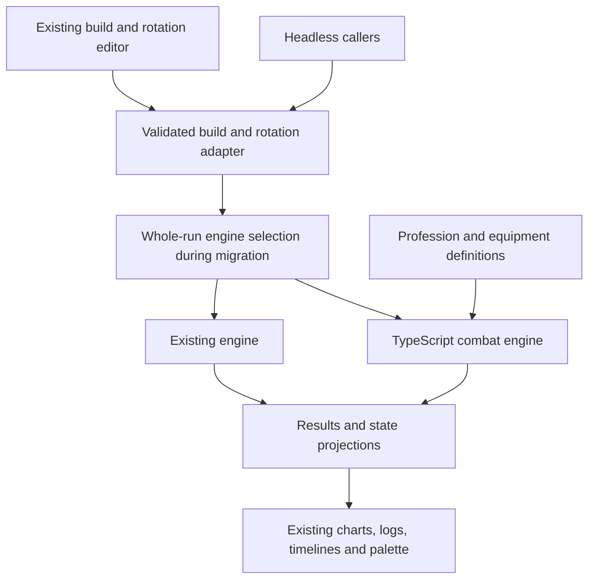

# gw2combat TypeScript migration: Guardian first, all professions

Date: 2026-09-16  
Status: Phase 2 implemented. The TypeScript engine reproduces the pinned C++ reference on the first Guardian build.
Phases 3.1–3.5 are implemented: inventories and measured legacy baselines are recorded in
[the prerequisite evidence](GW2COMBAT-PHASE-3-BASELINE.md), and the headless preview translates existing inputs and
projects results and worker-backed insertion state into the existing views. Guardian now exposes an opt-in historical
Willbender preview; legacy remains the default. Phase 3.6 completion evidence is next.

Target: all nine professions and their supported core/elite specializations, using the existing browser application.

## 1. Objective and completion boundary

Replace the current GW2 scheduler/resolver implementation with a TypeScript combat engine based on
[Mk-Chan/gw2combat](https://github.com/Mk-Chan/gw2combat). Preserve the existing build editor, rotation workflow,
presentation, saved data, and analysis features through explicit application adapters.

Guardian is the first implementation and validation vehicle. It is not the architecture's scope, and completing Guardian
does not complete this migration. The final engine must support Elementalist, Engineer, Guardian, Mesmer, Necromancer,
Ranger, Revenant, Thief, and Warrior without a separate simulation loop for each profession.

The intended benefit is one authoritative combat state: cast decisions, resource changes, damage, effects, and trait
reactions participate in the same simulation lifecycle. A port alone does not prove greater accuracy, better
performance, or simpler profession authoring; the milestones below must establish those outcomes.

The first deliverable is one upstream Guardian build running in TypeScript, checked against a pinned C++ reference, and
usable through the current UI, including rotation insertion and state-dependent skill availability. The final
deliverable also requires migration of every profession, application feature acceptance, and retirement of the old
runtime and temporary routing.

## 2. Evidence and current constraints

This plan was written from source inspection. Phase 2 has since pinned the upstream commit, reproduced a C++ build, and
run executed C++/TypeScript comparisons (see Phases 0 and 2 below). Phase 3.1 records the initial source-backed
profession inventory and current-engine performance baseline. Detailed mechanic validation remains part of each content
port.

### Current application

- [Architecture](ARCHITECTURE.md) and [module ownership](MODULES.md) already separate the kernel, GW2 platform,
  professions, application, and presentation.
- [simulateGw2](../../js/games/gw2/platform/simulation/simulate.ts) is the canonical simulation entry point.
- [The current pipeline](../../js/games/gw2/platform/simulation/pipeline.ts) schedules a rotation and then resolves its
  events. Optional refinement passes feed resolved information back into scheduling.
- [The clock contract](SIMULATION-EVENT-CLOCK.md) uses event-driven progression and microsecond canonical precision.
- [The baseline worker](../../js/games/gw2/app/simulation/baseline-simulation-worker.ts) already isolates expensive
  computation from the browser editor. Other simulation callers include the optimizer, RNG distribution, modifier
  contributions, relic comparison, patch comparison, and rotation prefix previews.
- [Palette state](../../js/games/gw2/app/rotation/shared/context.ts) depends on simulation state at the insertion
  cursor, not only on final DPS. Existing result types also expose scheduler internals that will need adaptation.
- [Guardian's implementation notes](../professions/GUARDIAN.md) describe Core, Dragonhunter, Firebrand, Willbender, and
  Luminary. Those all belong in the Guardian migration scope.
- The project already compiles strict TypeScript. Retain the existing TypeScript, Vite, Node test, and Playwright
  toolchain; a frontend rewrite is unnecessary.

### Upstream reference

- [The README](https://github.com/Mk-Chan/gw2combat/blob/master/README.md) describes build/rotation configuration and an
  entity-component-system architecture.
- [The combat loop](https://github.com/Mk-Chan/gw2combat/blob/master/src/combat_loop.cpp) advances an integer tick and
  runs ordered systems. Its millisecond progression differs from this application's event-driven clock.
- [Skill configuration](https://github.com/Mk-Chan/gw2combat/blob/master/src/configuration/skill.hpp) contains skill
  ticks, effects, modifiers, triggers, conditions, and bundle transitions.
- [Resources](https://github.com/Mk-Chan/gw2combat/tree/master/resources) include Guardian and Soulbeast examples;
  upstream is not strictly Guardian-only. These examples do not establish complete profession coverage.
- [The license](https://github.com/Mk-Chan/gw2combat/blob/master/LICENSE.txt) is MIT. Preserve the copyright and license
  notices with translated or copied material and account for any separately vendored dependencies.

These upstream links follow `master` for discovery. Reference runs use the immutable revision recorded in Phase 0.

## 3. Scope and architectural decisions

| Area          | Decision                                                                                    |
| ------------- | ------------------------------------------------------------------------------------------- |
| Language      | TypeScript, using the repository's strict compiler settings                                 |
| Runtime       | Headless Node execution and browser workers from the same engine source                     |
| Combat state  | One authoritative world per run, with actor ownership and ordered combat systems            |
| Initial clock | Faithfully reproduce the pinned upstream tick and ordering semantics before optimizing      |
| Content       | Profession-owned definitions and mechanics; shared combat rules remain profession-neutral   |
| UI            | Retain the application and adapt inputs/results/state projections                           |
| Migration     | Add the new engine alongside the old one; select one engine for each entire run             |
| Validation    | Separate upstream fidelity, current-game evidence, and application compatibility            |
| Final scope   | Every currently supported profession and specialization, with explicit modeling limitations |

Do not translate C++ templates or its ECS library into a general TypeScript framework. Begin with typed records, arrays,
maps, entity IDs, and directly ordered system functions. Reuse existing helpers only after establishing that their
semantics match the target contract. Do not import the old scheduler/resolver as a hidden implementation of new-engine
mechanics.

The core must not branch on profession names. Shared concepts include actors, skills, effects, resources, cooldowns,
ownership, and termination. Profession-specific resources and state machines live with their profession; their actual
requirements determine which shared operations are necessary. Do not prebuild every possible resource model before a
real mechanic needs it.

Preserve today's documented product scope, including outgoing-damage and encounter assumptions. Supporting all
professions does not implicitly add complete raid AI, positioning, PvP/WvW, or a full healing/support simulator.
Support-only actions that affect timing or traits must retain their modeled behavior. Record limitations explicitly.

## 4. Target composition and ownership



The routing layer and legacy branch are temporary. The final application has one engine.

### Suggested placement

Choose final names in Phase 0 after checking import-boundary rules. The following is an ownership proposal, not a
request to scaffold empty modules:

| Responsibility                                  | Suggested location or existing boundary                                         |
| ----------------------------------------------- | ------------------------------------------------------------------------------- |
| New combat runtime                              | `js/games/gw2/platform/combat-engine/`                                          |
| Shared world, clock, systems, effects, formulas | Inside the new runtime, split only as working code requires                     |
| Guardian implementation during coexistence      | `js/games/gw2/professions/guardian/combat-engine/`                              |
| Other profession implementations                | The equivalent directory under each profession                                  |
| Reusable identity and presentation metadata     | Existing profession catalogs/data, extracted from runtime assembly if necessary |
| Engine selection and request/result conversion  | Existing platform simulation and GW2 application boundaries                     |
| Reference comparison tooling                    | `scripts/analysis/`                                                             |
| Focused contracts                               | Existing `tests/platform/`, `tests/professions/`, and `tests/app/` ownership    |

New runtime code must not import browser application modules. Profession implementations may import shared combat
operations; shared combat code must not import profession implementations. Keep identity metadata independent of both
runtimes so loading a new profession does not incidentally assemble its legacy runtime.

Existing skills, trait selections, equipment, icons, IDs, and saved formats are reusable assets. Existing
scheduler/resolver callbacks are reference behavior to investigate and rewrite, not directly reusable new-runtime
mechanics. Avoid maintaining two hand-authored copies of the same immutable facts during migration.

## 5. Simulation lifecycle to implement

This lifecycle applies to every profession. Guardian exercises it first.

### 5.1 Validate and prepare a request

1. Validate imported builds, rotations, encounter values, IDs, numeric ranges, and supported capabilities at runtime.
2. Resolve the selected Core plus elite specialization, loadout, equipment, traits, patch data, and assumptions.
3. Convert saved/UI commands into typed engine commands while retaining their source indices for diagnostics.
4. Resolve engine selection once for the entire request. Record engine revision, data revision, mode, and seed in
   diagnostic metadata so a run can be reproduced.
5. Prepare immutable content independently of mutable run state. An optimizer may reuse immutable definitions; it must
   never share live actors, cooldowns, resources, or RNG state between trials.

TypeScript types are not a substitute for validation of JSON. Unknown or unsupported mechanics must be reported with the
responsible skill, trait, equipment item, or command. Never silently drop them to produce a plausible score.

### 5.2 Initialize a world

Create the player, target, owner relationships, selected skills, effects, resources, and random generator. Initialize
the logical clock and deterministic iteration order explicitly. Define how precasts and the combat-start marker map to
engine time without resetting cooldowns, resource changes, or effects that should carry into combat.

Keep the absolute simulation clock, combat-start reference, and DPS observation window distinct. The existing UI's
milliseconds/seconds conversions belong at named boundaries rather than being scattered through mechanics.

### 5.3 Advance combat

For the initial port, translate the pinned upstream's exact phase ordering, repeat-until-stable behavior, temporary
markers, and cleanup semantics. Extract a reviewed order table from that revision rather than inventing a simplified
equivalent. Preserve distinctions among accepting a cast, completing it, performing its packets, and resolving hits.

The contracts to settle include:

- Cast lanes, instant actions, channels, interrupted actions, and availability retries.
- Resource validation, spending, refunds, regeneration, cooldown commitment, ammo recharge, and resets.
- Skill pulses, delayed hits, projectiles, chained/triggered skills, and proc recursion limits.
- Attribute sampling, modifier ordering, critical/weapon rolls, and rounding.
- Boon/condition application, stack ownership, refresh, extension, consumption, expiration, and damage pulses.
- Actor spawn/despawn, independent actions, inherited attributes, and damage attribution.
- Equal-time ordering among all of the above and target death.

Use deterministic logical time, never wall-clock timers for combat. Add bounded-work protection and actionable failure
diagnostics for non-terminating rotations or trigger cycles. Do not swallow a simulation failure and expose a partial
result as a successful score.

### 5.4 Observe, terminate, and report

Define rotation exhaustion, active-skill completion, explicit duration, damage thresholds, target death, and optional
observation tails separately. Document whether boundary events are included and how precedence works when several
termination conditions occur together.

Accumulate the same damage in detailed and score-only modes. Score mode may omit histories and projections; it must not
change combat execution, proc decisions, or random draws. Diagnostics must also avoid changing those draws.

Return a structured result or explicit failure. Detailed output supplies activation identities, damage attribution,
timelines, warnings, resources, cooldowns, ammo, and the snapshots needed by the application. Clean up run-local state
so subsequent worker requests cannot inherit it.

### 5.5 Project editor state

The palette must answer availability at the rotation insertion point, including an insertion before the final command
and appending when the displayed simulation includes an observation tail. Define this instant precisely; it is not
necessarily the final damage timestamp.

Start by replaying the required prefix with the new engine and projecting its state. Include delayed actions already
active at that instant. Optimize with checkpoints only if profiling shows prefix replay is too expensive. A cached
projection must be invalidated by build, rotation, patch, engine, mode, and relevant seed changes.

The engine owns legality. The UI consumes its projected state or availability queries rather than maintaining a second
implementation of resource, cooldown, or profession rules.

## 6. Timing and fidelity policy

Port fidelity and current-game correctness are separate milestones. The initial reference lane uses the pinned C++
definitions and semantics. The production lane uses the selected game-data patch and explicitly reviewed deviations.
These can be separate development fixtures and data revisions; they do not require a permanent user-facing compatibility
mode or two independently maintained engines.

Before accepting real saved rotations, record the conversion policy for fractional milliseconds. Do not silently round
microsecond timestamps into integer ticks. If the production engine needs finer precision, change it in a separate,
evidenced step after reference fidelity, with focused boundary checks.

Likewise, audit same-time strike/condition order, effect lifetime boundaries, condition tick offset, periodic damage,
rounding, prepull behavior, and termination. The old engine, upstream engine, and game evidence can disagree. Record
each discrepancy and choose the intended behavior explicitly; matching either engine alone does not settle it.

Preserve observed cast behavior during translation, but follow the repository rule against adding tests specifically for
Quickness cast times or `interruptCommitMs` values.

Expected-value damage and stochastic execution also need separate definitions. A mean critical-damage multiplier does
not automatically model a critical-hit proc that changes later resources or casts. Inventory such branching mechanics,
document approximations, and use seeded stochastic behavior where required. C++ and TypeScript need not share random
samples unless the same RNG and draw order are deliberately ported; deterministic reference comparisons must not
accidentally depend on unrelated random sequences.

## 7. Delivery phases and exit gates

Each phase leaves runnable work and updates this document's status ledger. A phase is complete only when its exit
evidence is recorded. Several Guardian milestones do not imply all-profession readiness.

### Phase 0 — Inventory and reproducible reference

Deliverables:

- Pin the upstream SHA, source/license provenance, build toolchain, dependencies, build command, and run command. Keep
  C++ as a development reference; do not add a server dependency to the browser product.
- Build and run a reference encounter on a documented supported environment. If Windows needs WSL or a container,
  document the actual working route and its prerequisites.
- Select one Guardian fixture. Start by evaluating upstream's Willbender pistol/torch example because it is linked from
  its encounter configuration; confirm the selected revision's exact paths and that the encounter runs.
- Inventory every mechanic reached by that build, including shared traits, equipment effects, triggered skills, and
  target assumptions. Select a smaller included fixture if this dependency closure is unsuitable for a first pass.
- Capture the exact source/input/data revisions and reproducible aggregate results. Establish small reference scenarios
  for the shared contracts needed by the selected build.
- Inventory all production engine callers, result consumers, saved-data versions, Guardian mechanics, and all-profession
  coverage. Trace code rather than relying solely on implementation notes.
- Measure current latency, batch throughput, prefix replay, worker startup, memory, and bundle size on named workloads.
- Work in an isolated branch/check-out and preserve unrelated in-progress changes already in the repository.

Exit: another developer can reproduce the C++ run; the first Guardian scope and required contracts are enumerated; the
upstream revision and initial workload measurements are recorded. Do not claim reference parity before this gate.

Status: reference prerequisites were completed at the start of Phase 2. Phase 3.1 completed the initial
production-caller, result-consumer, saved-data, Guardian/all-profession ownership inventories and measured
current-engine baseline; see [the evidence and limitations](GW2COMBAT-PHASE-3-BASELINE.md). These inventories do not
claim current-patch mechanic validation or all-profession new-engine support.

| Item            | Recorded evidence                                                                                                                                                                                                                                                                                                                                                                     |
| --------------- | ------------------------------------------------------------------------------------------------------------------------------------------------------------------------------------------------------------------------------------------------------------------------------------------------------------------------------------------------------------------------------------- |
| Revision        | `cc9a0d069350516b6daba7d80d4395f9004971d5` (2025-12-14), MIT license, EnTT 3.11.1 vendored upstream                                                                                                                                                                                                                                                                                   |
| Build route     | `node scripts/analysis/gw2combat-reference/build-reference.mjs`. Windows 11 used the Visual Studio 2022 MSVC 14.44 x64 toolset: `/std:c++20 /EHsc /O2 /bigobj`, with upstream's makefile source list. `/MP` must stay off because parallel compilation crashed `cl.exe` with an internal compiler error. Other platforms run upstream `make`. WSL, MinGW, and CMake are not required. |
| Run command     | `gw2combat.exe --encounter <encounter.json> --audit-path <audit.json>`. Paths inside the encounter may be absolute.                                                                                                                                                                                                                                                                   |
| Fixture         | Upstream's default encounter: Willbender `build-cwb-pt-pp-skill-ticks.json`, `rotation-cwb-pt-pp.csv`, and a fractal-relic golem. Copies and provenance are in [`tests/fixtures/gw2combat-reference/`](../../tests/fixtures/gw2combat-reference/README.md).                                                                                                                           |
| Reproducibility | The reference is **not** deterministic. It seeds `std::mt19937` from `std::random_device`, and critical-strike procs and one random threshold draw from it on every run. Two 30-run samples of the canonical encounter ranged over 44,926–45,202 DPS. A deterministic variant (100% critical chance and a forced threshold) produced byte-identical audits across repeated runs.      |
| Initial timing  | One deterministic fixture run: C++ about 1.8 s, which includes its per-tick stdout logging; TypeScript about 3.1 s on Node 25.8.2. This is one development-machine sample, not the Phase 0 workload baseline.                                                                                                                                                                         |

### Phase 1 — Shared TypeScript kernel and minimal combat

Implement world initialization, stable entity ownership, ordered system execution, commands, casts, cooldowns, basic
effects, strike/condition damage, observation boundaries, and termination as required by the first fixture.

Define typed input, output, and diagnostic contracts. Use the current build/test infrastructure and add only the focused
engine checks needed to establish each behavior. Prove headless execution without browser globals.

Exit: minimal synthetic encounters run reproducibly in Node and a worker; tests cover their scheduling, state, resource,
ordering, and termination contracts. No Guardian-specific branch exists in the shared core.

Status: implemented, then superseded by Phase 2. Phase 1 built a headless kernel in
[`js/games/gw2/platform/combat-engine/`](../../js/games/gw2/platform/combat-engine/) with a simplified content model
(strike/effect packets, resource pools, wait and combat-start commands) and an invented system order. Section 5.3
requires the pinned reference's own order table, so Phase 2 replaced the kernel's internals and content model with a
port of that reference. The Phase 1 contracts that still apply were kept and moved into the Phase 2 tests: explicit
validation failures, bounded work, score/detailed equality, isolated runs over reused content, worker execution, and the
headless import boundary.

The three Phase 1 decisions deferred to Phase 2 were checked against the reference:

| Phase 1 decision                          | Reference behavior adopted in Phase 2                                                                                                                                                                                        |
| ----------------------------------------- | ---------------------------------------------------------------------------------------------------------------------------------------------------------------------------------------------------------------------------- |
| Packet offsets anchor to cast start       | Confirmed. Skill ticks count real milliseconds from cast start. Legacy `*_on_tick_list` actions track progress with and without quickness and fire when the combined percentage reaches each offset.                         |
| Recharge commits at cast completion       | Confirmed. A child actor's proc recharges the root owner's copy of the skill, and ammo recharges one charge at a time.                                                                                                       |
| Expected-value damage with no random draw | Replaced. `MEAN` critical mode still uses the expected multiplier, but every strike rolls a critical for on-critical procs. Random thresholds and weapon-strength rolls also draw. Draws come from a seeded per-run MT19937. |

Phase 1's resource pools and wait/combat-start commands were removed. The reference has neither (it uses counters and
per-cast `cast_time_ms`), and section 3 advises against prebuilding resource models. Profession resources return when a
real mechanic needs them.

### Phase 2 — First Guardian build and reference fidelity

Port the selected build's entire dependency closure: weapon and slot skills, its virtue behavior, selected traits,
equipment procs, attributes, condition effects, and required target configuration. Use the frozen upstream inputs first;
do not combine translation with current-patch coefficient edits.

Run C++ and TypeScript on focused matching scenarios. Investigate discrepancies at the earliest differing state
transition or calculation. Resolve integer division, rounding, iteration order, default-value, enum, and lifetime
differences explicitly instead of tuning damage coefficients until totals happen to match.

Run the full reference encounter as a diagnostic comparison. Automated saved-preset regressions remain limited to
loading/simulation and total DPS against a documented manifest value with at most 1% relative error.

Exit: the first build is executable, required mechanics have focused coverage, unexplained differences in those
contracts are resolved, and aggregate reference results satisfy the declared acceptance criterion. Full Guardian
coverage and current-game validation remain incomplete.

Status: exit criteria met for the Willbender reference fixture. The port is a direct translation of the reference's
systems, which are data-driven. Guardian behavior comes entirely from the frozen build JSON, so no Guardian code exists
in the engine and `professions/guardian/combat-engine/` is not needed yet.

| Module                 | Reference source and responsibility                                                                                                           |
| ---------------------- | --------------------------------------------------------------------------------------------------------------------------------------------- |
| `configuration.ts`     | `configuration/*.hpp`: typed build, skill, effect, and encounter schema; strict JSON validation; CSV and file-encounter resolution            |
| `registry.ts`          | EnTT semantics used by the reference: per-component pools iterated newest-first, swap-and-pop removal, smallest-pool views, LIFO id recycling |
| `queries.ts`           | `condition_utils`, `skill_utils`, `weapon_utils`: conditions, conditional skill groups, castability, weapon strength                          |
| `mutations.ts`         | `actor_utils`, cooldown and counter helpers, `side_effect_utils`: registration, effects, child actors, recharge, side effects                 |
| `effect-rules.ts`      | `effect_utils`, condition damage formulas, weapon strength ranges                                                                             |
| `systems/*.ts`         | One module per reference system group: setup, rotation, temporal, skills, attributes, combat, hooks, audit                                    |
| `loop.ts`              | `combat_loop.cpp`: the `TICK_ORDER` table, cleanup, and termination                                                                           |
| `run.ts`, `types.d.ts` | Public request/result/failure contracts, engine and reference identity, bounded work                                                          |
| `numeric.ts`, `rng.ts` | Banker's rounding, C++ integer division and truncation, seeded MT19937 with the reference's draw ranges                                       |

Why the registry mirrors EnTT: side effects, stack removal, child-actor spawning, and entity names depend on EnTT's pool
iteration order. The port therefore keeps one typed pool per component with EnTT's ordering rules instead of inventing
an order. It is not a general ECS: every view is an explicit call listing its pools.

Original Phase 2 evidence, before the corrections recorded below (reproduce with the commands in
[scripts/README.md](../../scripts/README.md) at engine revision `phase-2-reference`):

- **Deterministic lane:** the C++ and TypeScript audit streams for the deterministic fixture are identical. Both have
  11,105 events with the same order, child-actor identifiers, damage values, effect applications, and expirations. The
  run ends at 87,800 ms with 4,014,403 total damage.
- **Canonical lane:** 30 C++ runs averaged 45,120.4 DPS (sd 45.3). TypeScript seeds 1–30 averaged 45,121.6 DPS (sd
  55.1), a 0.003% difference in means and well within sampling noise.
- **Focused contracts:** 21 synthetic scenarios in `mechanics.test.js` and `side-effects.test.js` were run through both
  engines, and their event streams matched exactly. They cover strike and condition formulas and rounding, stack accrual
  and expiry, boon caps, Might limits, modifier and conversion order, chained triggers, shared recharge, ammo, cast
  completion, conditional groups, counters, cooldown modifiers, removals, weapon swap, cancellation, unique-effect
  stacking, effect-application hooks, the whirl combo, termination, and cast failure.
- **Acceptance criterion:** fixture DPS within 1% of the recorded C++ value, following the saved-preset rule. The
  canonical lane compares against the 30-run C++ mean and the deterministic lane against its exact value. Both pass in
  `reference-fixture.test.js`.

Recorded discrepancies and decisions:

| Finding                                                                                                                                        | Classification and decision                                                                                                                                                                                                                                                                                                    |
| ---------------------------------------------------------------------------------------------------------------------------------------------- | ------------------------------------------------------------------------------------------------------------------------------------------------------------------------------------------------------------------------------------------------------------------------------------------------------------------------------ |
| Six `stacking_type` keys on effect applications in the reference build are ignored by upstream's parser                                        | Input/data mismatch. The engine rejects unknown keys. The fixture loader removes these exact paths as declared errata, which reproduces what the C++ build simulates.                                                                                                                                                          |
| Upstream silently keeps the first of repeated attribute pairs and maps unknown enum strings to `invalid`                                       | Validation hardening. Both are rejected with a JSON path. Semantics of valid input are unchanged.                                                                                                                                                                                                                              |
| Upstream reads `recipe_paths` from disk during setup                                                                                           | Resolved by the caller through `resolveUpstreamEncounter`, which appends recipes in the reference order. The engine stays headless and rejects unresolved paths.                                                                                                                                                               |
| A zero accelerated duration beside a non-zero base duration divides by zero in C++                                                             | Rejected at validation instead of crashing.                                                                                                                                                                                                                                                                                    |
| The reference erases from a vector inside a range-for when cancelling skills                                                                   | Undefined behavior in C++. The port reproduces the observable skip of the next element without reading past the end. Cancellation in the fixture only touches single-skill child trackers.                                                                                                                                     |
| Critical rolls draw from an inclusive 0–100 integer, so a chance below 100% succeeds with probability ⌊100·p⌋/101                              | Reference quirk kept for fidelity. Review it against game evidence in Phase 4.                                                                                                                                                                                                                                                 |
| Upstream gives three skill names built-in behavior: `Weapon Swap`, `Lifesteal Proc` (no on-strike effects), `Burning Bolts` (fire-field whirl) | Resolved as content flags: skill `weapon_swap`, skill `skip_on_strike_hooks`, and build/recipe `whirl_finisher_skills` (combo field to skill). The shared core has no skill names. `withUpstreamSkillConventions` adds the flags to upstream input at the adapter boundary, and the fixture still matches C++ event for event. |
| Condition damage is modeled only for a stationary, idle golem (torment and confusion formulas)                                                 | Reference limitation, recorded for Phase 4 current-game validation.                                                                                                                                                                                                                                                            |
| Single-run speed (TypeScript about 3.1 s against C++ about 1.8 s for 87.8 s of combat)                                                         | Not a fidelity issue. Phase 6 must profile this before any batch or optimizer use.                                                                                                                                                                                                                                             |

Post-port corrections (`phase-2-effects-first-attribute-cache`):

- Pending effect applications now resolve before strikes so target-condition and source-boon modifiers apply to
  same-tick hits. On-strike applications resolve in a second, consuming pass after their triggering strikes. Condition
  damage payouts and end-of-tick health commits keep their existing positions.
- Relative attributes persist across ticks. Attribute-input pool changes add an encounter-wide `recalculateAttributes`
  component; the next calculation rebuilds into reusable actor-pair maps. Equipment, effects, modifier/conversion
  holders, ownership, and actor membership invalidate the cache. Health, counters, and cooldowns invalidate it only when
  attribute predicates depend on them, including nested predicates and conditional skill-group selection. Random
  predicates invalidate each tick so their results are not frozen. Expiration/removal invalidates when components are
  actually removed. In-place health/counter mutations explicitly mark the cache; future mutable inputs must do likewise.
- Effect audits retain the duration calculated when each application resolves, avoiding later-state duration changes or
  observer-only random draws. Stack-cap keys use visible `\0` escapes instead of literal NUL bytes in source.

These intentionally change the original event-for-event fidelity claim. Focused ordering/cache contracts live in
`tests/platform/combat-engine/attributes.test.js`; both frozen fixture variants still meet the 1% total-DPS criterion.
The first cache revision rebuilt all pairs because target predicates and global counters can affect other actors.

Profiling the deterministic fixture in score mode found about 51% of sampled time under every-tick hooks, 14% under
attribute calculation, and 7% under skill lookup (inclusive costs overlap). Skipping empty side-effect lists before
ownership traversal reduced the three-run warm median from 3.33 s to 1.74 s on the same local Node environment, with
unchanged DPS. The attribute cache alone left whole-fixture timing around 3.1 s because this encounter changes effects
frequently. After the empty-list shortcut, sampled costs were approximately 23% attributes, 22% every-tick hooks, and
11% skill lookup. Reproduce with `npm run build:modules` followed by `node scripts/analysis/profile-combat-engine.mjs`;
the script warms the fixture, measures three unprofiled runs, and profiles a separate run using Node's built-in
inspector.

The follow-up revision `phase-2-scoped-attributes-indexed-tick-hooks` narrows attribute invalidation to pairs containing
the changed actor, leaving unrelated pair maps untouched. Global counters, root membership changes, and random
predicates retain full invalidation. Stack-cap admission is target-independent and now runs once per holder; empty
holders still consume their reference stack slots. Destruction preserves ownership until dependent components have
notified their caches.

Every-tick hooks index eligible holders by root actor in original pool order. Pool and ownership revisions invalidate
the indexes on addition, replacement, removal, or reassignment. Predicates still evaluate at execution time; additions
to the current trigger pool wait for its next visit, while later pools see same-tick additions. Counter holders retain
their existing missing-reference checks even when their conditions require another stage.

On Node 24.14.1, the same three-run warm benchmark improved from 1.73 s to 1.26 s (27% less time), with unchanged
deterministic fixture DPS. Follow-up samples put attributes near 17%, every-tick hooks near 10%, and direct/conditional
skill lookup near 14% of sampled time.

Revision `phase-2-scoped-attributes-indexed-lookups` also indexes direct skills by immediate owner and key, using the
same lookup for execution and duplicate registration checks. Skill and ownership pool revisions invalidate the index;
duplicate keys retain the first match in reference view order. Conditional groups still resolve their members and
evaluate their conditions at lookup time. The warm median fell further from 1.26 s to 1.06 s (17% less time), with
unchanged deterministic fixture DPS. The focused lookup contracts cover cached reads, reassignment, replacement,
removal, entity recycling, duplicate precedence, and live conditional-group decisions.

Revision `phase-2-cached-termination-attribute-metadata` indexes termination actors by name until actor membership
changes. Downstate checks skip actor traversal when nobody is downed; configured condition order, wildcard rotation
selectors, and live health/completion checks are preserved, including temporary actors and recycled entities.

Attribute dependency analysis now persists until modifier, conversion, or conditional-group definitions change. Eligible
holder lists retain stack admission and resolved owners until their holder, ownership, effect, or unique-effect pools
change. Empty holders still consume stack slots. Predicates and conversion inputs continue to evaluate against live
state, and random predicates retain their draw order. Ownership and effect invalidation remains conservative.

On Node 24.14.1, the three-run warm median was 1.07 s before this change, 0.89 s after termination indexing, and 0.86 s
after attribute metadata caching (19% less time overall). Deterministic fixture DPS was unchanged; timings are local
measurements from the same profiling script, not a guarantee for other encounters. Focused tests cover cache reuse,
definition and cap changes, transitive skill-group dependencies, and termination ordering/membership.

Revision `phase-2-targeted-attribute-metadata` gives each modifier/conversion holder index its own structural input
revision. Ownership changes invalidate it only for its holders or their ancestors; effect and unique-effect changes
invalidate it only on immediate stack-cap parents. Empty and capped-out holders remain tracked. Pool clear operations
invalidate conservatively, and ownership-led views preserve their swap-and-pop order and leading-pool transitions.
Attribute-value dirty markers and live predicate evaluation remain unchanged.

At 40 ms, the original fixture's holder metadata rebuilds fell from 1,952 to 1,261 per index, while attribute-value
recalculations remained at 1,985. An interleaved comparison (three warmups and seven measured runs per implementation)
measured medians of 273 to 264 ms for the original fixture and 134 to 118 ms for Quickness Firebrand. Most other full
examples improved by 0–5%; the short sword/torch example went from 4.40 to 4.53 ms. DPS remained identical before and
after at both 1 ms and 40 ms across all eleven examples. These are local measurements, not guaranteed speedups.

This removes unrelated ownership/effect churn, but holder-pool edits still rebuild the index and dependency analysis.
Further gains require addressing those edits or value invalidation; this change alone does not reach the 200 ms target
for the slower Willbender examples.

### Phase 3 — Existing UI integration for that build

Status: Phases 3.1–3.5 implemented on 2026-09-16; Phase 3.6 has not started. Deliver an opt-in preview of the pinned
Willbender pistol/torch–pistol/pistol build in the existing Guardian workspace. Keep legacy as the default for every
profession. This phase proves application integration; current-patch Guardian coverage and analysis support remain
Phase 4.

#### Input contract: preserve the existing build and rotation models

The existing application build model and `RotationCommand[]` remain authoritative. Keep today's build editor, rotation
editor, saved schemas, imports, exports, and command semantics. Phase 3 adds a translation layer at the simulation
boundary; it does not replace those models with upstream files or require users to author engine configuration.

The input flow is: existing build and rotation -> translation adapter -> engine build/rotation configuration -> prepared
encounter -> combat engine. The adapter produces the structures represented by the engine's existing build JSON and
rotation JSON/CSV inputs. Pass validated objects in memory for normal simulation; writing JSON/CSV files and reading
them back is unnecessary. The existing file readers remain useful for reference fixtures and diagnostic tooling.

Translate the actual selected equipment, attributes, traits, skills, weapons, assumptions, and rotation on each request.
The pinned Willbender fixture supplies initial content/reference evidence, not a replacement for the user's build.
Unsupported mechanics are gaps in adapter coverage, not a reason to change the saved model. Preserve unsupported input
intact and report its responsible field or command; support expands without making users remodel their builds.

The combat engine remains pure. Application mechanics belong in `platform/simulation/combat-engine-adapter/` and
profession-owned content mappings. A skill makes an actor act; permanent unique effects express markers and conditional
behavior. Translate waits, off-target actions, and interrupted casts into those existing constructs. Do not add UI
commands, wait state, off-target flags, or interruption handling to the engine.

#### Scope and fixed decisions

- Offer an explicit `Legacy` / `Combat engine preview` selection in the existing simulation controls. Keep the selection
  in workspace session state and serialized simulation requests, outside the saved build schema. Missing selection means
  legacy. Changing engines cancels pending work, clears results and projections, and schedules a fresh run.
- Label preview content as the pinned upstream reference, including engine/content revisions, seed, and timing mode in
  diagnostics. Do not present its historical build data as the current game patch. Use the reference's mean weapon and
  critical-strike modes with a fixed, recorded seed for remaining random predicates; this is reproducible, not proof of
  an expected-value model for branching procs.
- Limit content to the first build's verified dependency closure. Allow rotation insertion, deletion, reordering, waits,
  and supported skill/weapon transitions. A build edit outside that closure produces an actionable unsupported-input
  error. Never keep simulating the frozen build while displaying different traits, equipment, or assumptions.
- Use the verified 1 ms step. The experimental 40 ms step is not the preview default. Reject fractional-millisecond
  timing with the source command and value; do not round, rewrite imported rotations, or silently substitute a coarser
  clock. Supporting finer precision is a separate evidenced change.
- Support target health/armor, combat-start markers, and the existing rotation, fixed-time, and tail observation
  policies for this slice. Keep absolute simulation time, rotation-end time, combat start, and the DPS window distinct.
  Controls whose semantics have not been implemented must report that limitation before a run.
- Defer optimizer, RNG batches, modifier/relic comparisons, patch comparisons, reference-rotation comparisons, EVTC
  integration, and diagnostic export parity. Disable their preview entry points with a reason and enforce the same
  rejection in headless/worker requests. Ordinary supported saved builds/rotations must still load and round-trip.

#### 3.1 — Close prerequisites and record the consumer map

Status: complete. [Recorded evidence](GW2COMBAT-PHASE-3-BASELINE.md) includes all production call paths, result
consumers, saved schemas, source-backed profession ownership, first-build translation requirements, reproducible
Node/browser measurements, and raw input hashes. Validation: build/typecheck/lint and emitted-output checks passed; 61
focused Node tests and 14 browser tests passed. Existing build/rotation models and runtime behavior are unchanged.

Complete the outstanding Phase 0 inventories and baseline measurements before implementation. Record actual commands,
workloads, Node/browser versions, hardware, and cold/warm timings; existing new-engine profiling is not a legacy
baseline. Keep the broader all-profession inventory separate from this build's support list. Do not mark Phase 0
complete solely because this UI slice has been scoped.

The source inspection for this plan establishes these starting points:

- `platform/simulation/simulate.ts` currently dispatches only to the legacy pipeline. `app/create-runtime.ts` uses it
  for ordinary simulation and synchronous rotation-prefix replay.
- `app/simulation/baseline-simulation.ts` calls it directly for baseline, patch, and reference-rotation results.
  `random-distribution/random-distribution-worker.ts`, `modifiers/modifier-contribution-worker.ts`, and
  `gear-optimizer/gear-optimizer.ts` also call it directly; modifying only the profession adapter would miss these
  paths.
- `app/create-runtime.ts` and `app/simulation/relic-comparison/relic-comparison-runner.ts` supply additional analysis
  paths through `simulateBuild`. Inventory the analysis scripts as headless consumers too.
- `app/rotation/shared/context.ts` caches prefix state by result object and insertion index. The palette also invokes
  legacy profession availability callbacks in `app/rotation/palette/model.ts`; changing result data alone is
  insufficient.
- `platform/simulation/types.d.ts` exposes `SchedulerState`, scheduler steps, and snapshots. The timeline currently
  reads `results.schedulerState.time` in `app/rotation/timeline/rows.ts`. Inventory all result consumers before deciding
  which fields to project, replace with explicit values, or make legacy-only.
- Guardian's build schema is version 3; saved workspace records use version 1. Reuse the existing build codec and
  `app/build/state/persistence.ts` / `workspace.ts`; inventory rotation imports and exports without introducing a schema
  bump just for engine selection.

Gate: every production caller and displayed field has an owner and a disposition: supported, adapted, or visibly
unavailable. Record baseline editor/prefix latency, worker startup, single-run and batch timing, memory, and bundle
size.

#### 3.2 — Translate existing builds and rotations at the simulation boundary

Status: implemented. `platform/simulation/combat-engine-adapter/input.ts` owns preview request validation and
`rotation.ts` emits ordinary engine configuration. `professions/guardian/combat-engine/compile.ts` compiles the selected
build, composed through `guardianProfession.simulation.compileCombatPreview`. The engine directory is unchanged.

The common entry point accepts an explicit
`selection: { engine: 'preview', contentRevision, patchId: 'reference', build }`, with the existing normalized build and
rotation. Missing selection remains legacy. Serialized baseline worker requests support the same preview contract;
legacy analysis config copies preserve engine identity and reject preview execution. Phase 3.3 now returns a UI result
alongside the raw engine outcome, with the requested observation window applied to reporting.

Implemented translations:

- Wait: an inert skill with the requested duration, using the normal cast lane.
- Off-target cast: a skill variant retaining self/team effects and stripping hostile packets, including child skills.
- Interrupted cast: a shortened skill variant; channel packets stop at the cutoff, while committed delayed packets
  retain their authored offsets. Existing conditional skill groups synchronize the original and variants' ammo and
  cooldowns. Recharge modifiers also target those variants; passive attribute modifiers remain on the original only.
- Concurrent instant action: a timed self marker plus a permanent unique effect queues the skill on the original actor,
  retaining engine castability checks. Inert delay skills prevent serial commands from passing the pending action.
- Combat-start: an inert marker skill. It does not reset effects or cooldowns. Unique generated skill keys map back to
  source indices in adapter metadata; interpreting its observation window belongs to Phase 3.3.

The first content closure fixes traits, weapons, rune, sigils, relic, food, utility, and selected slots to the saved
Willbender setup. Gear prefixes, infusions, Jade Bot core, starting weapon set, boons, target conditions, armor, and
health are compiled from the selected build. The common attribute calculator supplies base/equipment/consumable stats;
reference rune, food, Jade Bot, and utility stat contributions are removed where already supplied. Reference traits and
boon effects remain engine-owned. Per-set attribute differences use a conditional permanent unique effect.

Content provenance and resolved gaps:

- `reference-content.ts` is generated from the frozen fixture and its declared errata, with the upstream MIT notice.
  `node scripts/data/generate-guardian-combat-content.mjs --check` verifies it. Browser code imports no Node fixture
  loader.
- The selected Toxic Tuning Crystal uses the existing common attribute calculator. The reference's differently named
  Toxic Focusing Crystal conversion is removed, rather than silently treating them as interchangeable.
- The existing Radiant Fire flip-window value is shared by Guardian's current mechanics and the adapter; reference pulse
  damage remains pinned. This is an explicit UI-mechanics adaptation, not a current-patch balance port.
- The pinned engine's profession enum has no Willbender value. The adapter uses its generic `invalid` value with
  Guardian base class and explicit content, instead of carrying forward the fixture's incorrect Dragonhunter label.

Unsupported requests fail explicitly: other content/patch identities, other trait/equipment/slot combinations, cooldown
reset, charge release, imported initial-state options, fractional milliseconds, non-instant concurrent casts, concurrent
offsets below 2 ms, unsupported skills (including the equipped heal/elite absent from the reference content), and
analyses/prefix/observation options. Existing saved inputs are not rewritten. Per-command skill variants currently make
the full saved preview substantially slower than the bare reference run; performance remains a later phase gate.

Focused checks cover the translated mechanics, selected attributes, serialized request execution, input rejection,
legacy default routing, and successful headless execution of the existing saved Willbender build and rotation.

Validation: 3,210 Node tests passed, including reference DPS and all supported legacy presets. All 129 existing browser
tests passed; the added preview-worker test also passed, including unsupported-request recovery and absence of editor
imports. Production build, typecheck, lint, generated-content verification, and dist/site checks passed. The focused
adapter tests were rerun after the final timing/error-path refinements. Preview result rendering and selection remain
unexposed until the following subphases.

Add a small typed engine selection at `platform/simulation/simulate.ts` and its request contracts. Select once before
execution for both detailed and score requests. Preserve the legacy branch and existing default call signatures. Reject
unsupported preview operations at this shared boundary, not only in the UI. Carry selection and content identity through
baseline and analysis request builders, worker messages, and direct callers; never catch a preview failure and retry it
through legacy.

Keep shared input translation at `platform/simulation/` and add Guardian-owned content mappings under
`professions/guardian/combat-engine/` only as working code requires. Compose them at the existing profession/application
boundary. The shared runtime must not import Guardian. Pass validated content into the shared boundary rather than
importing a profession implementation there. Accept the existing normalized application build and rotation; add no
second application-facing build or rotation model.

Make required engine content browser-loadable, using the pinned fixture and declared errata as initial reference
material. Compile the selected build from that content and existing supported definitions rather than loading the
fixture as the user's build. Reuse one maintained source for shared immutable facts, preserve provenance/license
notices, and avoid importing the Node-only fixture loader or its `node:fs` dependencies into browser code. Use existing
numeric skill IDs and presentation metadata with an explicit map to reference skill keys, including
triggered/conditional skills and weapon swap. Do not resolve identity by display name alone or maintain a second
hand-edited copy of immutable content.

Validate the normalized saved build against the supported traits, equipment, skills, weapon sets, patch, assumptions,
and options before constructing an encounter. Explicitly map base attributes versus trait/boon modifiers so the existing
attribute calculator and reference effects cannot apply the same bonus twice. If upstream data lacks enough provenance
to describe an editable build field honestly, record and resolve that gap before exposing the preset.

Translate `RotationCommand[]` into the engine rotation sequence represented by its JSON/CSV inputs, mapping skill IDs to
engine keys and preserving order, waits, and supported timing semantics. The JSON rotation uses `skill_casts` entries
with `skill` and `cast_time_ms`; the parsed engine representation is `Rotation.skillCasts`. Carry command indices and
activation identities as adapter metadata rather than changing the persisted commands.

Check each command's semantics against what that format actually expresses. An absolute earliest-cast timestamp is not
automatically equivalent to a wait relative to the previous cast's completion, and a combat-start marker is not a cast.
Use ordinary engine skills and conditional effects for state-dependent translation; do not compute a second combat
timeline through the legacy scheduler. When an existing command cannot be represented faithfully by the current adapter,
add the smallest content translation needed while keeping the application's command and the engine unchanged. Record
that mapping before exposing it. The 3.1 inventory found off-target preparation, concurrent offsets, interruptions,
waits, and a combat-start marker in the existing Willbender acceptance rotation: these must work before the first UI
slice can pass. Remaining unimplemented variants (such as cooldown reset, charge release, and imported initial-state
actions) must fail explicitly rather than being dropped or reinterpreted. Combat-start remains an observation marker
without resetting live effects or cooldowns.

Gate: a normalized supported build and edited rotation execute headlessly through the common entry point. Invalid
skills, unsupported build changes, command options, analysis operations, and non-integral timing fail with responsible
fields or command indices. Existing unselected callers still use legacy.

#### 3.3 — Supply truthful results and observation windows

Status: implemented in `combat-engine-adapter/result.ts` and `observation.ts`. Success returns
`{ ok, output, identity, reference, result }`; failure retains the structured engine error without a partial result.
`reference` preserves reference totals and termination; `result` contains the existing presentation fields. The Guardian
content identity is now `guardian-willbender-cc9a0d0-adapter-2`. The engine directory remains unchanged.

Per-command metadata records stable IDs, source indices, and shortened/cancelled casts. Packet-only child variants
retain their originating activation, including overlapping casts; shared triggered procs keep their own identity without
guessing a triggering command. Child content with passive side effects is explicitly rejected because cloning it would
duplicate actor-wide registrations. Cast completion comes from audits; death cannot manufacture an END event. Equal-time
event-log rows preserve audit order.

`Gw2SimulationViewResult` supplies renderer facts and an explicit `rotationEndTime`; legacy execution extends it with
its real scheduler/end-state fields. Preview results omit those fields. Chart, table, timeline, log, and summary
consumers accept the shared view. Prefix/palette state remains Phase 3.4. Audits expose condition payouts and effect
applications but not individual stack lifetimes: payout charts and effect log rows are available, while stack averages
are `null` (displayed as “—”) and effect-uptime charts are omitted. No preset warnings are suppressed.

Implementation boundary policy (2026-09-16): audit timestamps are authoritative, with both ends of the reporting window
included and audit order retained at equal timestamps. Downstate wins over configured termination; fixed time stops
precede rotation/active-skill stops. An inert adapter skill marks command-lane exhaustion; a following inert skill
supplies an observation tail. Active-skill completion is an explicit preview observation option and does not imply
condition expiration. Absolute ends before command completion are rejected unless death ended the run. An explicit
combat-start marker filters reporting only: precast damage still changes the reference world. DPS starts at the first
retained positive player payout; environment DPS starts at the marker (or zero). Conditions retain reference payout
timing, including buffered pre-marker accrual paid after the marker; no interpolated damage or unpaid end-window
fraction is invented. Raw reference totals remain separately accessible. Score projection uses the same detailed engine
audit internally until generic window accounting exists, with histories omitted on output. Its engine identity therefore
records `mode: 'detailed'`; the outer `output` identifies the requested view. The marker follows ordinary millisecond
skill scheduling. Rotation reports exclude any subsequent exhaustion-housekeeping tick, and tails end exactly at the
marker plus the requested duration.

Validation (2026-09-16): all 3,217 Node tests and 131 browser tests passed, including the unchanged reference fixture's
1% total-DPS gate and legacy saved presets. Focused cases cover repeated/child/proc attribution, interruption versus
death, marker filtering, player/environment separation, rotation/active/tail/absolute boundaries, empty windows,
score/detail parity, and work-limit failures. The saved Willbender build/rotation also feeds the existing chart,
damage-table, and event-log projections. A browser check mounts the real summary, timeline, damage tables/charts, and
event log with no scheduler or end-state object. Typecheck, lint, production build, and generated-content checks passed.
Prefix state and the visible selector have not been implemented.

Keep application command identities in the adapter. Map the generated per-command skill keys directly to adapter
metadata and use generic engine cast audits to establish acceptance and completion. Carry that identity into
child/trigger attribution without adding UI commands to engine state. `skillStatus` describes only the terminal world;
additional observation must remain generic and free of extra RNG draws or combat mutations. Preserve the frozen
reference adapter's behavior.

Adapt results at `platform/simulation/` into the existing chart, damage-table, event-log, and timeline contracts. Reuse
renderers wherever the semantics match. Project rotation steps from accepted commands and actual cast lifecycle events;
do not infer repeated casts by matching names after the run. Preserve stable skill IDs, source indices, owner
attribution, warnings, and deterministic equal-time ordering.

Replace consumed scheduler internals with explicit projection fields, starting with rotation-end time. Keep legacy-only
internals behind a discriminated result or narrow consumer contracts; do not manufacture a fake `SchedulerState`, cast
the entire result through `any`, or run the old scheduler to fill holes. Add only the shared view fields that inspected
consumers need.

The new engine's `totalDamage` includes encounter damage and its `dps` uses the whole encounter clock. The application
reports player damage separately from environmental damage and uses an observation window. Compute those values from
engine-owned attribution and window accounting, consistently in detailed and score modes, rather than copying the raw
reference totals. Keep the original reference totals available for reference checks.

Implement rotation exhaustion, active-skill completion, target death, fixed observation end, and observation tail as
separate boundaries. Document equal-time inclusion and stop precedence before coding; preserve legacy product semantics
where required, with explicit differences from the reference lane. Handle empty rotations and zero-length DPS windows
without non-finite values. A structured engine failure must become a visible simulation failure, never a successful
partial score. Identify and scope any intentional preset warnings rather than suppressing them.

Gate: the supported build renders timeline, player/environment totals, strike/condition breakdown, event log, warnings,
and target/observation settings without invoking legacy combat code. Small scenarios establish attribution and
observation semantics; the reference fixture remains within its existing 1% total-DPS criterion.

#### 3.4 — Project insertion state from the same engine

Status: implemented on 2026-09-16. The shared `simulateGw2` boundary accepts `operation: 'prefix'` with a validated
`insertionIndex`. The adapter compiles that command prefix, then uses the unchanged engine's preparation, setup, loop,
and castability queries. Index zero returns initialized state. Other boundaries are after that tick's cast completion,
equipment changes, hooks, packets, and cleanup, before accepting another UI command. Future delayed packets are not
drained; report observation tails do not affect insertion state. Queries omit audit history and expose real ID-keyed
ammo/cooldowns, weapon set, bundle, counters, and availability reasons. A target death before the cursor or an engine
failure returns an explicit failure without publishing a partial projection.

`PrefixSimulationRunner` reuses the baseline worker endpoint with a distinct prefix operation. A 40 ms debounce
coalesces cursor changes; worker replacement interrupts abandoned loops. Results are guarded by worker/request identity,
build revision, tab, insertion index, preview selection/content/patch, mode, and seed. Pending/error states clear
current availability. Engine revisions are fixed by the loaded application bundle; no state persists across deployments.
The app owns worker construction, keeping it outside palette modules reachable from headless adapters. The palette and
state snapshot consume the projection without legacy legality/resource callbacks or a synchronous preview fallback. The
transient `previewSelection` hook is exercised by browser tests; the production selector remains Phase 3.5.

Validation: focused synthetic checks cover beginning/middle/append, cast-completion equipment and counters, delayed
effects, cooldown/ammo, target death, work limits, and direct engine castability agreement. Worker tests cover
coalescing, identity invalidation, late success/error messages, recovery, and unavailable workers. The browser check
completes the saved Willbender sequence with a larger target, abandons an active append query for a middle cursor, and
verifies main-thread timers continue during projection (a 250 ms timer completes within 1.5 seconds). The saved
4-million-health target can die before append, which intentionally reports unavailable. Validation passed: 3,225 Node
tests, 132 browser tests, production build, type checking, lint, touched-file formatting, and distribution/site checks.
The prefix browser case took 10.7 seconds in the full two-worker suite; this is responsiveness evidence, not Phase 6
latency acceptance. Replay remains the implementation, without checkpoints.

Add a headless prefix projection using the same preparation, execution, and castability queries as a full run. The
insertion point is the boundary after the selected prefix has completed its required cast lane and before the next
command is accepted. Index zero means initialized state; appending uses rotation-end state even when the displayed
result includes a damage tail. Keep active delayed packets/effects in the world through that boundary, without running
them to completion just to obtain availability. Settle the equal-tick phase for this projection with a minimal execution
test.

Return explicit time, active weapon set/bundle, ID-keyed ammo, cooldowns, supported profession resources/counters, and
skill availability with reasons. Use engine castability for conditional/flip skills; the preview palette must not apply
legacy legality callbacks on top. Resources absent from this build should remain absent, not fabricated as zero/full.

Replace synchronous preview replay in `app/create-runtime.ts` / `app/rotation/shared/context.ts` with worker-backed
requests and a pending projection state. Reuse the worker endpoint/message pattern with a distinct request purpose or a
dedicated prefix worker if needed; rendering must never run the tick loop on the main thread. Debounce/coalesce cursor
changes and invalidate by build/rotation revision, insertion index, engine/content/patch identity, mode, and seed. Do
not show old availability as current while a new projection is pending or failed.

Gate: beginning, middle, and append projections agree with execution for cooldowns, ammo, weapon/conditional-skill
transitions, and pending delayed effects. Moving the cursor on a long rotation leaves editing responsive. Start with
prefix replay; add checkpoints only if measured latency requires them.

#### 3.5 — Expose the preview and preserve worker isolation

Status: implemented on 2026-09-16. Guardian's rotation builder now has a **Simulation engine** selector with **Legacy**
and **New engine preview — historical Willbender**, plus **Load Willbender reference**. The reference button loads the
existing saved build and rotation assets through their existing codecs. The selector and engine identity remain
session-only; saved inputs retain their schemas, and a page reload starts in legacy mode. Select preview again to run
the restored input. The displayed Player DPS, timeline, skill breakdown, charts, and event log use the selected engine.

The baseline runner accepts explicit preview requests, validates responses against request/revision/worker/selection
identity, and replaces abandoned synchronous workers after a 40 ms debounce. Engine switches terminate idle workers as
well. Preview requests cannot use the browser's synchronous fallback. Prefix and baseline requests share build capture;
unsupported edits clear the prior result and surface the responsible validation field. Tab switches discard preview
selection and refuse to reuse cached preview results as legacy output. Late reference-asset loads cannot overwrite newer
edits, tabs, or engine choices.

Capability messages and disabled controls cover patch changes, cooldown reset, conditional attribute previews,
transition delays, RNG, modifier/relic comparisons, rotation comparison, and the gear optimizer. Request boundaries also
reject unsupported analyses. Non-zero saved transition-delay preferences must be reset in legacy before preview use;
they are never silently dropped. Ordinary build edits remain available and are validated by the existing adapter.

Focused checks cover input preservation, request rejection, worker replacement/identity validation, late success/error
messages, unavailable/blocked workers, reference loading, editing, result inspection, unsupported-edit recovery,
save/reload, and explicit legacy rollback. The browser acceptance flow uses the visible selector and real workers.
Validation passed: 3,227 Node tests, 134 browser tests, production build, type checks, lint, generated-output/site
checks, and formatting for all files touched by this phase. The aggregate `npm run check` stops at 56 pre-existing
formatting failures outside this phase; its remaining checks were run separately and passed. Combat-engine code is
unchanged. Phase 3.6 still owns the consolidated acceptance/performance evidence; this does not claim full Guardian
coverage or default cutover.

Wire the selector, labeled reference preset, supported rotation palette, result views, and capability messages into the
existing Guardian app. Keep current-patch patch controls and unavailable analyses clearly disabled for this historical
preview. Build controls can remain editable, but unsupported changes must invalidate the prior score and explain what is
unsupported; a disabled control alone is not request validation.

Extend `baseline-simulation-runner.ts` and the prefix runner to preserve request ID, build revision, engine identity,
and worker identity checks. Use worker termination/replacement for engine changes, abandoned expensive runs, and
relevant build/preset changes; a synchronous loop cannot process a queued cancellation message. Coalesce ordinary rapid
edits so replacement does not create unbounded worker churn. Test late success and error messages from terminated
workers.

Keep preview calculation off the browser main thread. If workers are unavailable or blocked, report preview unavailable
with an explicit legacy choice; do not reuse the current synchronous browser fallback for expensive preview runs.
Headless Node execution remains supported. Clear preview state when switching builds/tabs or engines, and exercise
rollback by selecting legacy and loading the same saved input without rewriting it.

Gate: a browser user can select, load, edit, simulate, inspect, save/reload supported inputs, and return to legacy.
Stale work cannot publish after a cursor, build, tab, or engine change; errors leave the next valid request runnable.

#### 3.6 — Validation and completion evidence

Implement in the order above, keeping the preview hidden until request, result, and prefix contracts work. Reuse
existing Node and Playwright infrastructure. Add focused checks alongside the affected engine, app, worker, and browser
tests:

- Routing and validation: default legacy behavior, explicit preview, unsupported capability rejection, source-indexed
  diagnostics, command translation, and engine identity through serialization.
- Translation compatibility: existing build/rotation inputs remain unchanged after translation, supported edits change
  the generated engine configuration, saved data round-trips through existing codecs, and small scenarios preserve
  command order and timing semantics. Do not substitute a frozen fixture when an input changes.
- Execution/projection: observation boundaries, empty prefix, delayed work, cooldown/ammo/state transitions, activation
  identity, attribution, detailed/score agreement, seeded repeatability, and isolation between runs.
- Browser acceptance: load the reference build, edit at beginning/middle/end, change target/window settings, inspect the
  existing views, reject an unsupported edit/analysis, reload saved input, replace a busy worker, and return to legacy.
- Regression coverage: existing Guardian and non-Guardian legacy smoke checks, import boundaries, worker bundles, and
  reference fixture load/simulation with total DPS within 1% of the recorded manifest value.

Do not add full-result snapshots, per-skill benchmark totals, fixed saved-rotation ordering/counts, exact benchmark DPS,
or tests specifically for Quickness cast times or `interruptCommitMs`. Use minimal scenarios for exact engine
assertions.

For each implementation batch, format touched files, then run focused Node/Playwright tests, `npm run build`, and
`npm run typecheck` as appropriate. Run `npm run check` before declaring this UI integration complete because its shared
request/result changes reach every profession. Record interactive timings against Phase 0 and any preview limitations;
Phase 6 still owns performance acceptance and default cutover.

Exit: all six gates have recorded evidence; the supported Guardian build loads, edits, simulates, and renders through
the new engine; insertion-state projections agree with execution; unsupported inputs/features fail explicitly; legacy
rollback preserves saved data. Update the status ledger only then. Full Guardian coverage, other professions, general
analysis support, default cutover, and legacy retirement are not Phase 3 completion claims.

### Phase 4 — Current-patch Guardian content and full Guardian scope

Expand from the reference fixture to the complete Guardian inventory below. Migrate current authoritative content and
document deviations from the frozen upstream reference. Validate mechanics with controlled game evidence when available,
and record uncertainty where it is not.

Complete all Guardian-facing analysis paths: deterministic and seeded RNG runs, optimizer score mode, modifier and relic
comparisons, patch previews, reference rotations, EVTC imports, and exports. Every analysis must use the same selected
engine semantics and appropriately validated content.

Exit: Core and every supported Guardian elite meet their coverage checklists, saved presets load and simulate with
visible/accounted-for warnings, and all existing Guardian product features work or retain an explicitly documented
pre-existing limitation. One successful benchmark is not this gate.

### Phase 5 — Prove portability with other professions

Before declaring the authoring contract stable, implement a focused Thief slice for resource-gated casting and a Ranger
slice with an independently acting pet. Soulbeast reference examples alone do not prove autonomous pet support.

These slices use the same world and loop as Guardian. Extract shared operations only where the concrete mechanics show
the need. Feed contract changes back through Guardian's focused tests and UI acceptance checks.

Exit: at least one resource-driven non-Guardian build and one build with an independently acting owned actor work
through the shared runtime. There is no Guardian-specific assumption in skill selection, resources, ownership, output
attribution, or state projection. Remaining specs for those professions are still tracked as unported.

### Phase 6 — Performance acceptance and Guardian default cutover

Use the same hardware/browser/Node versions and named workloads as Phase 0. Compare cold/warm single runs, prefix
editing, detailed/score runs, RNG batches, optimizer workloads, allocations, and retained worker memory.

Record numeric acceptance budgets before deciding readiness. The initial proposal is no more than 20% regression in warm
interactive p95 latency or batch elapsed time versus the recorded baseline, no unbounded retained-memory growth, and
responsive editing during background work. These are proposed gates, not measured results; tighten them if the old
experience is already too slow. Any changed budget must be recorded with its user impact.

Optimize only measured bottlenecks. Consider immutable-content reuse, output allocation reduction, then proven clock or
storage optimizations. Skipping ticks requires proving that no periodic work, boundary, or condition sample is lost;
performance does not justify silently changing simulation semantics.

Make the new engine Guardian's default only after Phases 4–6 pass. Retain temporary legacy selection for rollback, with
engine identity clear in comparisons and diagnostics. Do not overwrite user builds to change the default.

Exit: recorded acceptance results support the cutover, unsupported combinations cannot masquerade as supported, and a
documented rollback has been exercised.

### Phase 7 — Complete all professions

Migrate each remaining profession using the same lifecycle: inventory, focused mechanics, application integration,
game-evidence review, preset checks, performance, default cutover, and rollback readiness.

The sequence below is provisional and ordered by useful contract pressure. It is not a restriction on eventual scope.
Finish each profession's supported core/elite coverage rather than treating a successful sample build as completion.

Exit: every row in the all-profession matrix is accepted, and shared changes have been checked against previously
migrated professions. Future or newly added specializations use this same lifecycle.

### Phase 8 — Retire legacy code and temporary compatibility

Remove old engine routing, scheduler/resolver-specific profession registrations, duplicate content, obsolete result
fields, and transition-only adapters after all professions and consumers have migrated. Preserve useful engine tests by
moving their contracts rather than deleting coverage wholesale.

Retain saved-build and rotation compatibility where users still need it. Retiring an execution engine is not a reason to
discard user-data migrations. Archive the frozen reference instructions and provenance. Update architecture,
programmatic API, profession, and contributor documentation to describe the final engine.

Exit: production has one engine; no runtime caller depends on the old scheduler/resolver; the full repository checks
pass; all nine professions and existing product workflows remain usable. This is the migration's completion gate.

## 8. Guardian coverage and implementation order

The exact first-build dependency closure takes priority over the order below. For example, the initial Willbender
fixture necessarily brings its required Willbender mechanics forward. No specialization may be marked complete from that
partial implementation.

| Slice                 | Inventory and behavior to account for                                                                                                                                 | Acceptance evidence                                                                                  |
| --------------------- | --------------------------------------------------------------------------------------------------------------------------------------------------------------------- | ---------------------------------------------------------------------------------------------------- |
| Shared foundations    | Attributes, gear, runes/sigils/relics, boons, conditions, target assumptions, trait selection, weapon eligibility                                                     | Focused formulas, stacking, proc, loadout, and validation contracts                                  |
| Core                  | All supported terrestrial weapons and slot skills; chains, flips, symbols, channels, delayed/persistent attacks; Justice/Resolve/Courage; Renewed Focus; weapon swaps | Skill-family coverage, virtue state transitions, cooldown/resource/ordering checks, palette behavior |
| Weapon-specific state | Pistol/torch interactions, spear illumination, persistent fields, finishers, variant identities, and other inventory findings                                         | Minimal state/lifetime scenarios and correct available-skill projections                             |
| Dragonhunter          | Modified virtues, Spear of Justice/Hunter's Verdict, traps, traits, and supported weapon interactions                                                                 | Link/flip/lifetime contracts and build/UI acceptance                                                 |
| Willbender            | Movement virtues, virtue windows, hit-triggered behavior, trait stacks, off-target assumptions, and weapon interactions                                               | Trigger ownership, shared-time ordering, refresh/expiration, and modifier contracts                  |
| Firebrand             | Tome entry/stow, shared pages, costs/regeneration, chapter availability, trait changes, Ashes attribution/consumption                                                 | Resource and bundle transitions, regeneration and effect ownership, palette/state acceptance         |
| Luminary              | Radiant Forge entry/exit/duration, radiant weapons, Glaring Burst variants, recharge changes, light-field/finisher interactions                                       | Form and lifetime transitions, variant identities, cooldown changes, combo contracts                 |
| Whole profession      | Core plus each elite, every supported build option, import/export, prefixes, reference runs, optimizers, RNG and patch previews                                       | Feature acceptance and saved-preset load/simulation/DPS checks                                       |

The inventory must include passive traits, trait substitutions, inherited core mechanics, equipment interactions, and
user-selectable assumptions, not only skills present in saved benchmark rotations. Audit the current source before
treating these rows as exhaustive.

For each mechanic, record: source and patch; owner; inputs; state written/read; trigger and ordering; resource or
cooldown effects; expiry/cleanup; UI projection; unsupported assumptions; focused validation; and migration status. Keep
this as a checklist/table with links to owning code and checks, rather than building a new tracking framework.

## 9. All-profession rollout matrix

Specialization names below reflect this repository's current declared support, not a claim that upstream implements
them. Phase 0 confirms the implementation inventory. Every listed specialization is in the final migration scope.

| Suggested order | Profession and scope                                          | Mechanics that challenge the shared contract                                 | Status      |
| --------------- | ------------------------------------------------------------- | ---------------------------------------------------------------------------- | ----------- |
| 1               | Guardian: Core, Dragonhunter, Firebrand, Willbender, Luminary | Virtues, pages/tomes, triggered effects, forms, weapon variants              | Not started |
| 2               | Thief: Core, Daredevil, Deadeye, Specter, Antiquary           | Initiative, resource-gated skills, stealth/flip states, profession resources | Not started |
| 3               | Ranger: Core, Druid, Soulbeast, Untamed, Galeshot             | Pets, actor ownership, commands, merge/unmerge, independent attacks          | Not started |
| 4               | Elementalist: Core, Tempest, Weaver, Catalyst, Evoker         | Attunements, dual skills, overloads, orbs, elementals and familiars          | Not started |
| 5               | Mesmer: Core, Chronomancer, Mirage, Virtuoso, Troubadour      | Illusions, shatters, blades, replacements, owned-actor attribution           | Not started |
| 6               | Revenant: Core, Herald, Renegade, Vindicator, Conduit         | Energy, upkeep, legend swaps, summons and stance state                       | Not started |
| 7               | Necromancer: Core, Reaper, Scourge, Harbinger, Ritualist      | Life force, forms/shroud, minions, health-dependent decisions                | Not started |
| 8               | Engineer: Core, Scrapper, Holosmith, Mechanist, Amalgam       | Kits/toolbelt, heat/forms, mech behavior, resource and skill replacement     | Not started |
| 9               | Warrior: Core, Berserker, Spellbreaker, Bladesworn, Paragon   | Adrenaline/flow, burst gates, transformation, charge/release state           | Not started |

Phase 5 uses partial Thief/Ranger slices before Guardian default cutover. Their complete migrations occur in Phase 7.
The remaining order can change after inventory or evidence collection without reducing scope.

## 10. Application and saved-data migration

Preserve stable profession/skill/trait identities, storage keys, build JSON, rotation JSON, and import/export behavior
where possible. The application adapter compiles those inputs into new engine definitions; a new runtime does not
require a new user-facing save format.

If a format change is necessary, version it explicitly, test old-to-new loading and round trips, preserve an exportable
original, and never overwrite stored data after a failed conversion. Keep game patch, engine revision, and save-format
version separate. Handle duplicate display names using IDs rather than name-only identity.

Temporary routing must be based on actual supported capabilities, not merely `profession === 'guardian'`. A partially
ported specialization may expose an unimplemented trait, weapon, relic, assumption, or optimizer candidate. Resolve
coverage before execution, reject unsupported new-engine requests, and let the application select legacy explicitly when
appropriate. Never mix old-engine casts or procs into a new-engine run.

| Consumer                   | Migration requirement                                                                                      |
| -------------------------- | ---------------------------------------------------------------------------------------------------------- |
| Build editor               | Reuse catalogs and calculated attributes without applying trait/equipment bonuses twice                    |
| Rotation editor            | Preserve commands, waits, combat-start/reset semantics, timing intent, undo, and insertion positions       |
| Skill palette              | Query correct resource, cooldown, ammo, weapon/form, chain, and specialization availability                |
| Timeline and event log     | Preserve activation linkage, delayed effects, owner/skill attribution, warnings, and diagnostics           |
| Charts and summaries       | Preserve damage windows, condition payouts, target-health accounting, and reference comparisons            |
| Workers                    | Serialize requests/results, reject stale jobs, surface errors, support cancellation/replacement            |
| RNG distribution           | Use isolated seeded runs and clearly declared stochastic versus expected behavior                          |
| Gear optimizer             | Validate every candidate's coverage; use score mode with identical combat behavior                         |
| Modifier/relic comparisons | Recompute changed attributes/mechanics and use consistent engine/patch/window settings                     |
| Patch previews             | Apply explicit content revisions without mixing reference and current-patch definitions                    |
| EVTC/log imports           | Preserve source timing/identity and report unsupported actions; do not change parsers just to force parity |
| Headless API               | Preserve a documented simulation route for tests and scripts, with explicit errors and supported options   |

Do not fabricate `schedulerState` or old snapshots merely to satisfy a result type. Inventory their consumers, retain
stable display contracts where useful, and replace dependencies on execution internals with explicit projections.

## 11. Verification strategy and repository policy

### Three independent gates

| Gate                  | Reference                                                        | What passing establishes                                            |
| --------------------- | ---------------------------------------------------------------- | ------------------------------------------------------------------- |
| Port fidelity         | Pinned C++ source and matching inputs                            | The translated contract behaves as intended by that reference       |
| Game accuracy         | Controlled game observations and sourced current-patch mechanics | The chosen production behavior has evidence beyond either simulator |
| Product compatibility | Existing UI/headless workflows and saved data                    | Users retain working editing, execution, analysis, and persistence  |

When results disagree, classify the cause as translation defect, input/data mismatch, intentional model change,
application conversion defect, or unresolved game behavior. Reduce it to a minimal scenario. Record the decision,
evidence, and affected professions before adjusting expected values. Neither old-engine agreement nor benchmark DPS
agreement alone establishes correctness.

### Automated checks

- Add focused tests for scheduling, cooldowns, resources, transitions, event order, lifetimes, actor ownership,
  observation windows, validation, loading, and migration. Exact assertions are appropriate for those contracts.
- Use the existing Node and browser test infrastructure. Place checks with their actual owner.
- Saved-preset tests may verify loading and successful simulation. Numerical preset regressions compare only total DPS
  with the manifest value, with maximum relative error of 1%. Record the reference value's patch/window origin.
- Do not add saved-rotation shape tests, fixed indices/order/length assertions, per-skill aggregate cast/hit/damage
  regressions, exact benchmark DPS assertions, or whole-result snapshots.
- Do not add tests specifically for Quickness cast times or `interruptCommitMs` values.
- Preserve warnings. Fix the emitting preset or explicitly document and narrowly scope an intentional warning; blanket
  suppression is not an acceptance strategy.
- Compare detailed/score output on a minimal encounter to establish equal numerical results. Test seeded reproducibility
  and run isolation without assuming different languages use identical RNG streams.

Reference tooling may emit temporary diagnostic traces for investigation, but those traces must not become broad
saved-rotation golden tests. Automated comparisons should assert the smallest relevant contract.

For implementation batches, run the focused checks, build, and typecheck appropriate to the change. Run the repository's
full `npm run check` before default cutovers and legacy removal. Format every touched supported file with
`npx prettier --write <touched-files>`; do not reformat unrelated files. Follow the repository requirement for short
functional comments when adding/editing functionality.

## 12. Rollout, rollback, and maintenance lifecycle

Each profession moves through:

```text
inventoried -> reference/mechanics verified -> preview in UI -> complete coverage
            -> feature/performance accepted -> default -> legacy retired
```

Record evidence for each transition. A preview can intentionally support a subset; a default must meet its declared
coverage, and final retirement requires every profession and consumer.

Rollback changes engine selection for subsequent runs and invalidates affected results/caches. It does not rewrite the
user's build or pretend previously computed results came from the other engine. Exercise loading the same saved build
under the available legacy path before Guardian cutover. Identify which newly introduced features, if any, cannot run in
legacy mode and surface that limitation.

For regressions, record the engine/data revision, minimal input, expected contract, actual result, and affected
professions. Fix shared causes in shared systems and rerun the already-migrated profession contracts they affect.

After migration, handle balance updates separately from engine changes: update sourced facts and patch provenance,
review affected mechanics, run focused checks and saved-preset smoke/DPS checks, then update manifests only from
justified evidence. Do not automatically track upstream `master`; evaluate useful upstream fixes against the pinned
reference and intentional deviations. The TypeScript project owns its added profession implementations.

## 13. Risks, decisions, and stopping conditions

| Risk or decision                                        | Required response                                                                                   |
| ------------------------------------------------------- | --------------------------------------------------------------------------------------------------- |
| Upstream reference cannot be reproduced                 | Resolve the toolchain/input issue before claiming fidelity; independent inventory work can continue |
| Upstream example represents an older patch              | Freeze it for translation checks, then make current-patch changes separately                        |
| Tick progression loses current timestamp precision      | Document conversion and boundary consequences before accepting real saved rotations                 |
| C++ defaults/rounding/order differ from JavaScript      | Specify and test the particular contract rather than compensating in content                        |
| Guardian dictates a narrow state model                  | Use Thief and autonomous-pet Ranger slices before freezing the profession contract                  |
| Existing UI depends on scheduler internals              | Replace those dependencies with explicit projections; retain visual workflows                       |
| Per-tick execution is too slow for batch analysis       | Profile and optimize measured work; block default cutover if budgets fail                           |
| Expected-value mode misrepresents branching procs       | Declare the approximation and validate or implement the required stochastic behavior                |
| One migrated build is mistaken for profession support   | Require the complete mechanic/spec/capability inventory before marking coverage complete            |
| Legacy and new content drift during coexistence         | Share verified immutable facts and log mechanic fixes against both affected paths                   |
| Current engine contains useful behavior absent upstream | Port it deliberately with evidence; upstream parity is the starting point, not the product ceiling  |
| Broad rewrite obscures whether the design helps         | Stop expansion at the failed gate, fix the specific issue, then resume the all-profession plan      |

No fixed completion estimate is assigned before the reference build, coverage inventory, and first UI slice. Those
milestones expose the actual porting effort and are the basis for scheduling the remaining professions.

## 14. Implementation status and first work package

| Milestone                            | Status      | Required evidence before completion                                                                                             |
| ------------------------------------ | ----------- | ------------------------------------------------------------------------------------------------------------------------------- |
| Plan recorded                        | Complete    | This document                                                                                                                   |
| Upstream revision and C++ reference  | Complete    | Recorded under Phase 0 status; initial inventory and legacy baseline completed in Phase 3.1                                     |
| Shared TypeScript core               | Complete    | Phase 1 kernel, replaced in Phase 2 by the reference port; see Phase 1 status                                                   |
| First Guardian reference build       | Complete    | Original reference fidelity verified; subsequent effect-order/cache corrections documented under Phase 2; fixture DPS within 1% |
| Phase 3.1 inventory and baseline     | Complete    | Evidence in GW2COMBAT-PHASE-3-BASELINE.md; 61 Node and 14 browser tests passed                                                  |
| Phase 3.2 input adapter              | Implemented | Existing saved Willbender inputs run headlessly; skill/effect translations, request validation, and legacy routing checked      |
| Phase 3.3 result adapter             | Implemented | Audit attribution, observation windows, shared view contracts, and headless rendering                                           |
| Phase 3.4 insertion projection       | Implemented | Engine castability and boundary state, worker cancellation, pending/error palette state, and responsiveness checked             |
| Phase 3.5 preview UI                 | Implemented | Guardian selector, reference loading, selected-engine results, capability gates, worker isolation, and legacy rollback          |
| First Guardian UI slice              | In progress | Phases 3.1–3.5 implemented; consolidated acceptance evidence (3.6) remains                                                      |
| Complete current-patch Guardian      | Not started | Core plus all four elites and product feature checks                                                                            |
| Non-Guardian portability slices      | Not started | Thief resource and independent-pet Ranger evidence                                                                              |
| Guardian performance/default cutover | Not started | Recorded budgets/results and exercised rollback                                                                                 |
| All remaining professions            | Not started | Accepted matrix rows and cross-profession checks                                                                                |
| Legacy retirement                    | Not started | One production runtime and full repository checks                                                                               |

The next work package is Phase 3.6: consolidate acceptance evidence, remaining validation cases, and interactive timings
against the recorded baseline. Continue one subphase at a time with its validation gate. Preserve the engine's
skill/effect model and the application's saved schemas.

Update this document as implementation proceeds: record the pinned revision, chosen fixture, source/data references,
actual paths, performance budgets, intentional deviations, acceptance evidence, and remaining coverage. Add separate
supporting documents only when real findings outgrow a concise section here.
